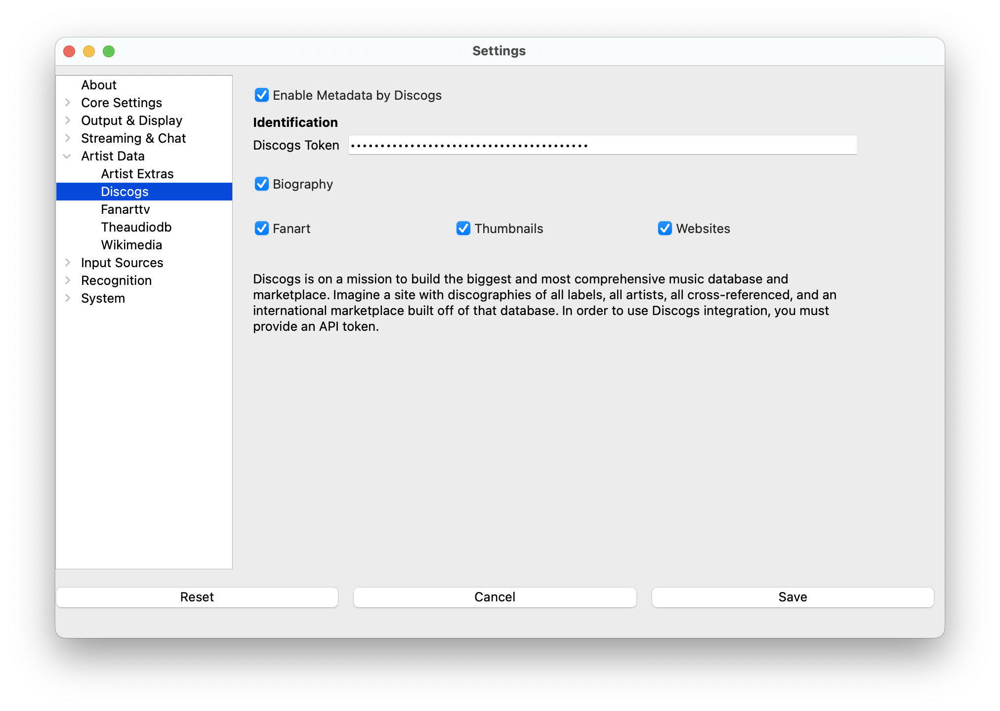

# Discogs

Provides: Biographies, Fan art, Thumbnails, Websites

Media tags required: album and artist

[Discogs](https://www.discogs.com) is a well-known source for music
release information, a marketplace, and more. Be aware of Discogs Terms
of Use as linked to on their [API
Page](https://www.discogs.com/developers). All you need to do is [Get a
personal access token](https://www.discogs.com/settings/developers).
Discogs uses a pure text-search; results may be somewhat unreliable.
