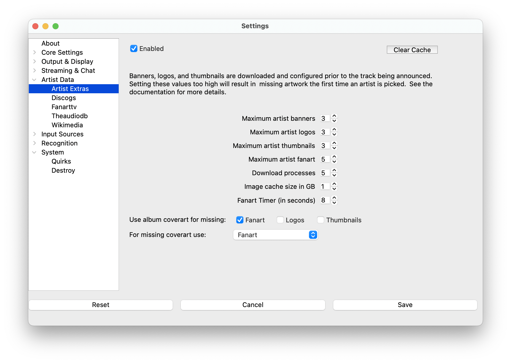

# Artist Extras

Artist Extras automatically downloads additional content about artists during live DJ sets, including images (banners,
logos, thumbnails, fan art) and biographies. This enhances audio-only streaming with visual content and background
information.

> **Note**: Many settings in this section require restarting **What's Now Playing** to take effect.

## What You Get

### Images

| Type | WebSocket URL | Raw Image URL | Size | Description |
|------|---------------|---------------|------|-------------|
| **Banners** | /artistbanner.htm | /artistbanner.png | 200px × unlimited | Artist image with name text |
| **Fan Art** | /artistfanart.htm | N/A | 800px × 1280px | High-quality background images |
| **Logos** | /artistlogo.htm | /artistlogo.png | 200px × 480px | Stylized artist text/graphics |
| **Thumbnails** | /artistthumb.htm | /artistthumb.png | 480px × 200px | Artist photos |

### Biographies

Artist biographies are available in two formats:

* **artistlongbio** - Full biography content
* **artistshortbio** - Biography truncated to fit in a single Twitch chat message

## Setup

> **Note**: Artist Extras settings are located under Artist Data in the settings menu.

## How It Works

### Download Timing

Content downloads during the write delay period (set in [General Settings](../settings/index.md)):

1. **Immediate downloads**: Banners, logos, and thumbnails download first
2. **Background downloads**: Fan art continues downloading while the track plays
3. **Track changes**: New banners/logos/thumbnails are selected if available
4. **Artist changes**: Full download process starts for the new artist

### Multi-Artist Support

For collaborations (e.g., "David Bowie & Lou Reed"):

* Attempts to download content for both artists
* Only one set of images is displayed (banners, logos, fan art)
* Both artists' content is cached for future use

### Caching

* **Local storage**: All content is cached locally for fast access

* **Automatic cleanup**: Old content is eventually removed to manage disk space

* **Hourly verification**: Cache is verified every hour for performance

* **Clear Cache button**: Removes artist-to-image mappings but preserves API response cache

## Configuration

### Download Limits

Control how much content to download per track:

* **Banners/Logos/Thumbnails**: Downloaded first, before track announcement

* **Fan Art**: Downloaded continuously while track plays

* **Size Limit**: Total cache size in GB (approximately 1,000 images per GB)

### Performance Settings

* **Download Processes**: Background workers for downloading content
  * Higher = faster downloads but more system load
  * Lower = gentler on system resources but slower downloads

* **Write Delay**: Give more time if images appear "empty" initially

### Fallback Options

When specific image types aren't available:

* Use cover art for missing fan art
* Use cover art for missing logos
* Use cover art for missing thumbnails

## Requirements for Best Results

Artist Extras works best with well-tagged music files:

* **ISRC codes**: Enable automatic MusicBrainz lookups for missing metadata

* **Complete artist/album/title tags**: Improve matching accuracy

* **MusicBrainz integration**: Provides artist IDs for more accurate results

## Available Services

Configure specific services for different types of content:

* **[Discogs](discogs.md)** - Artist information and album artwork

* **[TheAudioDB](theaudiodb.md)** - Artist biographies and additional images

* **[FanArt.TV](fanarttv.md)** - High-quality curated artist artwork

* **[Wikimedia](wikimedia.md)** - Free artist biographies from Wikipedia

## Troubleshooting

### Images Not Appearing

* Increase write delay in General Settings (try 10+ seconds)
* Check that Artist Extras is enabled
* Verify your music files have good artist/title tags

### Slow Performance

* Reduce download processes (try 2-4)
* Lower image download limits
* Check internet connection speed

### Cache Issues

* Use "Clear Cache" button to reset image mappings
* Restart **What's Now Playing** after changing cache size
* Monitor disk space usage

### Missing Content for Artist

* Check if artist exists in the configured services
* Verify artist name spelling matches service databases
* Try enabling MusicBrainz for better artist matching
