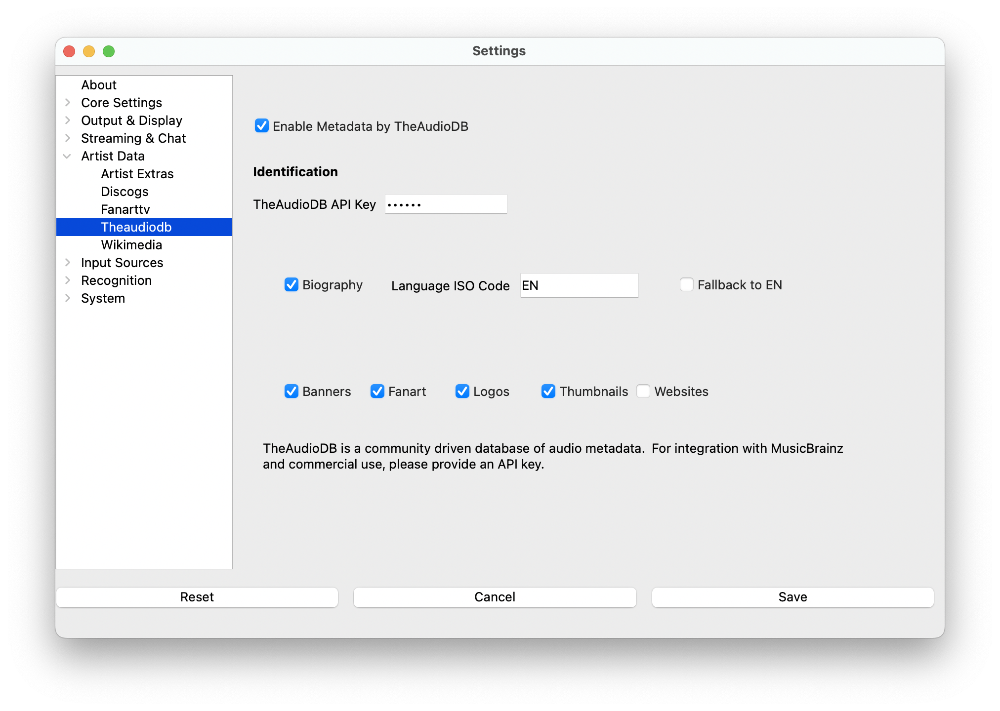

# TheAudioDB

TheAudioDB is a community-driven music database that provides comprehensive artist information, high-quality artwork,
and detailed metadata. It offers excellent coverage across all music genres and works with both artist name searches
and MusicBrainz IDs for maximum flexibility.

## What TheAudioDB Provides

**Content Types:**

* Artist banners and promotional images
* Detailed artist biographies and background information
* Fan art and background images
* Artist logos and graphics
* Artist thumbnails and photos
* Website links and social media information

**Strengths:**

* Comprehensive artist coverage across all genres
* Detailed biographies with rich background information
* Fallback artist name search when MusicBrainz IDs aren't available
* Good balance of mainstream and independent artist coverage
* Multiple image types and variations per artist

**Flexibility:**

* Works with MusicBrainz Artist IDs (preferred for accuracy)
* Falls back to artist name search when IDs unavailable
* Good coverage for both popular and lesser-known artists

## Setup

> **Note**: TheAudioDB settings are located under Artist Data in the settings menu.

### API Access

1. Visit [TheAudioDB API Guide](https://www.theaudiodb.com/api_guide.php)
2. Register for an account and request an API key
3. Copy your API key once provided
4. Paste it into the **What's Now Playing** TheAudioDB settings

### Media Requirements

TheAudioDB works with minimal requirements:

* **Artist name** (minimum requirement)

* **MusicBrainz Artist ID** (preferred for better accuracy)

* **Album/title information** (helps with disambiguation)

## How TheAudioDB Works

### Lookup Strategy

TheAudioDB uses a two-tier approach for maximum coverage:

1. **Primary lookup**: If MusicBrainz Artist ID is available
   * Direct lookup using the unique MusicBrainz ID
   * Highest accuracy and reliability
   * Preferred method when available

2. **Fallback lookup**: When no MusicBrainz ID is present
   * Text search using artist name
   * Good coverage but may require disambiguation
   * Still provides comprehensive results

### Content Quality

* Community-curated database with quality standards
* Rich biographical information from multiple sources
* High-resolution artwork suitable for streaming
* Regular updates and community contributions

## Configuration Options

### Content Selection

* **Enable biographies**: Download detailed artist background information

* **Enable images**: Download banners, fan art, logos, and thumbnails

* **Enable websites**: Include artist social media and official links

* **MusicBrainz preference**: Prioritize MusicBrainz ID lookups over name search

### Performance Settings

* **Timeout configuration**: Adjustable API request timeouts

* **Caching**: All responses cached to minimize API usage

* **Rate limiting**: Automatic throttling to respect API limits

## Best Practices

### Improve Accuracy

* Enable MusicBrainz recognition for automatic Artist ID population
* Use well-tagged music files with complete artist information
* Consider using AcoustID to populate MusicBrainz data automatically
* Keep consistent artist naming in your music library

### Optimize Coverage

* TheAudioDB excels as a comprehensive fallback service
* Works well for artists not covered by FanArt.TV
* Good balance between quality and coverage
* Effective for both mainstream and independent artists

### Performance Optimization

* Let MusicBrainz run first to populate Artist IDs when possible
* Fallback name search still provides excellent results
* Cache settings help reduce API calls during live performances

## Troubleshooting

### No Results Found

* **Check artist name spelling**: Verify against TheAudioDB.com manually

* **Try name variations**: Remove articles like "The", try alternate spellings

* **Enable MusicBrainz**: Provides more accurate lookups

* **Verify API key**: Ensure API key is valid and active

### Duplicate or Wrong Artists

* **Common artist names**: Names like "Madonna" may return multiple matches

* **Use MusicBrainz IDs**: Eliminates ambiguity with unique identifiers

* **Add album context**: Additional metadata helps disambiguation

* **Check TheAudioDB manually**: Verify correct artist exists in database

### Missing Content Types

* **Artist coverage varies**: Not all artists have complete information

* **Biography availability**: Depends on community contributions

* **Image availability**: Some artists may have limited artwork

* **Recent artists**: Very new artists may not be in database yet

### API Issues

* **Rate limiting**: TheAudioDB has usage limits for API access

* **Network timeouts**: Adjust timeout settings if experiencing issues

* **API key problems**: Verify key is active and has proper permissions

* **Service availability**: Check TheAudioDB service status

## Integration with Other Services

TheAudioDB works excellently alongside other Artist Extras services:

* **Complement FanArt.TV**: TheAudioDB for coverage, FanArt.TV for curated quality

* **Work with Discogs**: Different strengths and artist coverage

* **Enhance with MusicBrainz**: Provides accurate Artist IDs for better matching

* **Fallback strategy**: Excellent as primary or secondary service

## Community and Database

* **Community-driven**: Built and maintained by music enthusiasts

* **Open contributions**: Community members can add and edit information

* **Quality focus**: Balance between comprehensive coverage and quality

* **Regular updates**: Database continuously updated with new artists and information

* **Genre diversity**: Strong coverage across all music genres and eras
