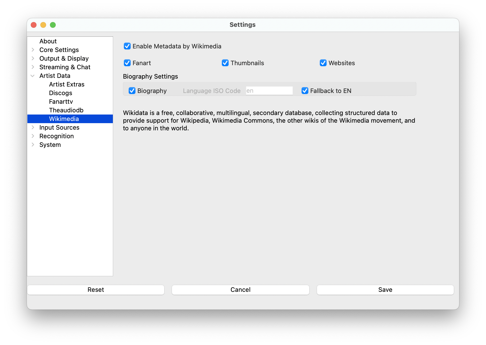

# Wikimedia

Wikimedia provides free, open-source artist biographies and background information sourced from Wikipedia and other
Wikimedia projects. This service offers high-quality, encyclopedic content about artists across all genres and eras,
with no API key required.

## What Wikimedia Provides

**Content Types:**

* Detailed artist biographies from Wikipedia
* Background information and career histories
* Artist descriptions and contextual information
* Multiple language support for international artists

**Strengths:**

* Completely free with no API key requirements
* High-quality encyclopedic content
* Comprehensive coverage of notable artists across all genres
* Multiple language support for better international coverage
* Community-maintained and regularly updated
* Reliable, factual information from trusted sources

**Coverage:**

* Excellent for established and notable artists
* Strong historical coverage across all music eras
* Good international artist coverage with multilingual support
* Limited coverage for very new or obscure artists

## Setup

> **Note**: Wikimedia settings are located under Artist Data in the settings menu.

### Configuration

No API key required! Simply:

1. Open Artist Data settings in **What's Now Playing**
2. Navigate to Wikimedia configuration
3. Enable biography downloads
4. Select preferred languages for content
5. Configure performance settings as needed

### Language Selection

Wikimedia supports multiple languages:

* **Primary language**: Default language for biography content

* **Fallback languages**: Additional languages to try if primary isn't available

* **Automatic detection**: Uses artist origin/region when possible

## How Wikimedia Works

### Content Sources

Wikimedia draws from the Wikimedia Foundation ecosystem:

* **Wikipedia**: Primary source for artist biographies

* **Wikidata**: Structured data about artists and relationships

* **Wikimedia Commons**: Free media files (though images handled separately)

### Lookup Process

1. **Artist identification**: Uses artist name from track metadata
2. **Wikipedia search**: Searches Wikipedia for matching artist articles
3. **Content extraction**: Extracts relevant biographical information
4. **Language handling**: Tries preferred languages, falls back to available content
5. **Caching**: Stores content locally to minimize requests

### Content Quality

* Editorial standards maintained by Wikipedia community
* Neutral point of view and verifiable information
* Regular updates from global community of editors
* Multiple language versions often available

## Configuration Options

### Content Selection

* **Enable biographies**: Download artist biographical content

* **Biography length**: Control how much content to retrieve

* **Language preferences**: Set primary and fallback languages

### Language Settings

* **Primary language**: First choice for biography content (e.g., "en" for English)

* **Secondary languages**: Fallback options when primary unavailable

* **Auto-detection**: Attempt to detect appropriate language for artist

### Performance Settings

* **Request timeouts**: Configurable timeout for Wikipedia API calls

* **Caching duration**: How long to store content locally

* **Rate limiting**: Respectful API usage with automatic throttling

## Best Practices

### Improve Content Quality

* Use accurate artist names that match Wikipedia article titles
* Consider common name variations (e.g., "The Beatles" vs "Beatles")
* Well-tagged music files help with accurate artist identification

### Language Optimization

* Set appropriate primary language for your audience
* Configure fallback languages for better international coverage
* Consider artist origin when selecting language preferences

### Performance Optimization

* Wikimedia is lightweight with no API key restrictions
* Excellent as a primary biography source
* Fast response times due to Wikipedia's global infrastructure
* Effective caching reduces repeat requests

## Troubleshooting

### No Biography Found

* **Check artist name**: Verify spelling matches Wikipedia article titles

* **Try name variations**: Search Wikipedia manually to find correct article name

* **Notable artists only**: Wikipedia typically covers notable/established artists

* **Language availability**: Try different language settings

### Content Quality Issues

* **Multiple artists**: Common names may return wrong artist information

* **Disambiguation**: Some artist names may need disambiguation (add genre/era context)

* **Incomplete content**: Some artists may have brief Wikipedia articles

### Language Problems

* **Primary language unavailable**: Content may fall back to other languages

* **Encoding issues**: Verify language settings match your system configuration

* **Translation quality**: Different language versions may have varying detail levels

### Performance Issues

* **Network connectivity**: Verify internet connection to Wikipedia

* **Timeout settings**: Adjust timeout values if experiencing slow responses

* **Cache problems**: Clear cache if experiencing stale content issues

## Integration with Other Services

Wikimedia works excellently alongside other Artist Extras services:

* **Biography focus**: Specializes in high-quality biographical content

* **Complement image services**: Use with FanArt.TV/Discogs/TheAudioDB for images

* **Free alternative**: No API costs unlike commercial services

* **Primary biography source**: Often the best starting point for artist information

## Advantages of Wikimedia

### Cost-Effective

* **Completely free**: No API keys, registration, or usage limits

* **No rate limiting concerns**: Generous usage policies for applications

* **Sustainable**: Supported by Wikimedia Foundation, not dependent on commercial services

### Quality Assurance

* **Editorial standards**: Wikipedia's editorial policies ensure quality content

* **Community oversight**: Thousands of editors maintain and improve content

* **Verifiable information**: Sources and citations required for content

* **Neutral perspective**: Balanced, encyclopedic coverage

### Technical Reliability

* **High availability**: Wikipedia's robust global infrastructure

* **Fast response times**: Optimized content delivery worldwide

* **Multiple formats**: Flexible API supporting various content formats

* **Long-term stability**: Established service with consistent API
