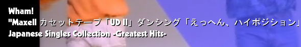

# Gallery of Templates

**What's Now Playing** has quite a bit of flexibility in what kind of
output you can generate to the point that there are nearly infinite
possibilities. The text versions are meant to be used to feed other
systems and are rather basic. E.g., the basic text template generates:

> Utah Saints - Something Good '08

Picking that template, configuring a text source, configuring a scroll
filter on that source, and then writing to it via OBS WebSocket allows
one to do:

For the HTML templates, there are generally two varieties, one that uses
WebSockets (start with ws-) and those that do not. WebSocket varieties
are more likely to get updates closer in sync with the rest of your
display. However, older software stacks may not support WebSockets.

AAdditionally, the templates are typically named to have 'fade' or
'nofade'. 'Nofade' generally stay on the screen for the duration of the
song. 'Fade' will appear for a while and then disappear, only to
reappear when the song changes:

Here are some pictures of the bundled HTML template files being used
with an OBS stream.

- cover-title-artist:

- mtv:

- mtv-cover:

The software writes output in UTF-8. That covers the vast majority of
characters that one may hit. Be aware that OBS and other software may
need to have their settings, such as fonts, changed to support non-ASCII
characters!

