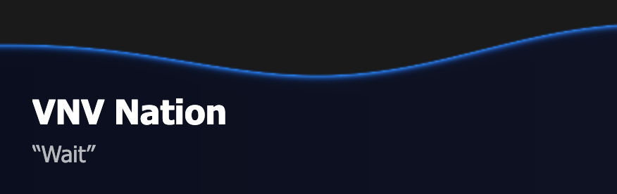
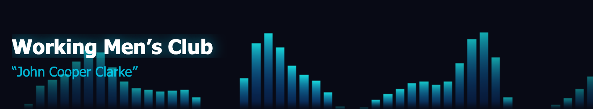
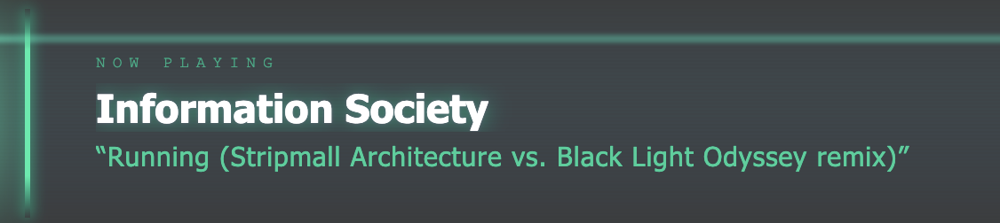
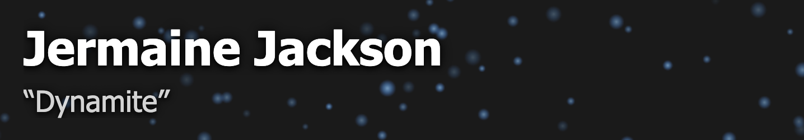
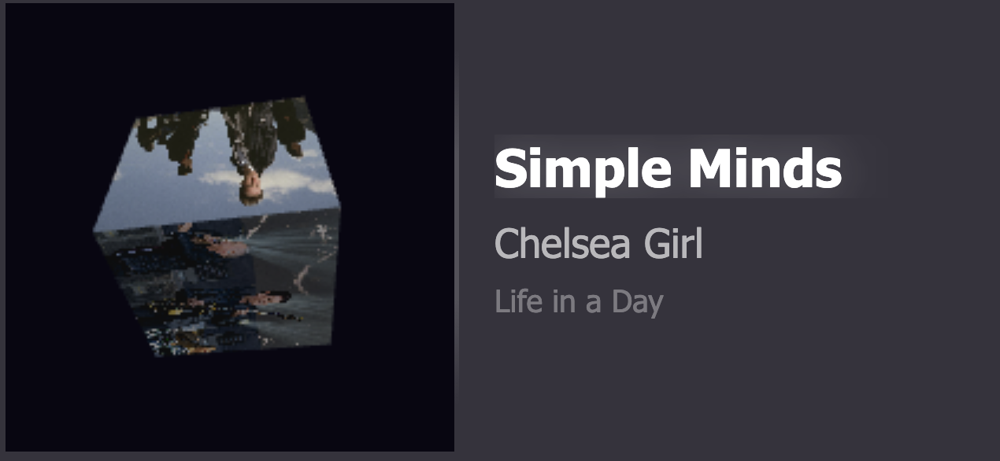

# WebGL Template Gallery

Most of these templates use WebGL shaders for GPU-accelerated animations. OBS Studio's
built-in browser (CEF) supports WebGL out of the box.

All templates are 800px wide. Set your OBS browser source to the listed dimensions.

## ws-webgl-vinyl

**Dimensions:** 800 × 200

A spinning vinyl record with cover art mapped onto the disc as a WebGL texture. The center
label shows the art at full brightness while the outer groove area darkens it with procedural
ring overlays. Artist, title, and album are displayed in the text panel beside the disc.

## ws-webgl-wave

**Dimensions:** 800 × 150

A dark navy panel whose top boundary is two overlapping sine waves, with a blue glow line
tracing the edge. The stream shows through above the wave. Artist and title sit in the
lower portion of the panel.

## ws-webgl-spectrum

**Dimensions:** 800 × 150

56 animated fake EQ bars rendered in WebGL with a cyan-to-indigo gradient. The bars pulse with
overlapping sine waves and burst upward briefly when a new track starts. Artist and title are
overlaid on top.

## ws-webgl-hologram

**Dimensions:** 800 × 150

A cyberpunk-style panel with a teal scanline shader, periodic sweep glow, and horizontal glitch
slice displacement on each track change. Artist and title scramble in character-by-character with
a random noise reveal effect.

## ws-webgl-particles

**Dimensions:** 800 × 150

Fully transparent background — no panel. Soft blue particles drift upward over the stream
continuously, with a burst of larger faster particles on each track change. Artist and title
are rendered directly over the stream with a drop shadow for legibility against any content.
Uses Canvas 2D rather than WebGL for reliable alpha compositing in OBS browser sources.

## ws-webgl-cube

**Dimensions:** 800 × 200

A rotating 3D cube rendered in WebGL, textured with artist fanart images. Face 0 always shows
the current track's cover art; faces 1–5 are filled with fanart fetched live via the images
WebSocket as they become available. The cube uses diffuse lighting against face normals for
depth. If fewer than 6 fanart images are available, remaining faces fall back to cover art.
Artist, title, and album are displayed in the text panel beside the cube.

## ws-artistfanart-slideshow

**Dimensions:** 1920 × 1080 (full-screen)

Similar to the other artist fanart templates but instead of crossfading, images slide in from
the right and out to the left on a CSS `translateX` transition every 8 seconds. Fetches up to
20 fanart images live via the images WebSocket and cycles through them full-screen. Uses
`background-size: contain` so no part of the fanart is cropped. Resets automatically when
the artist changes.
