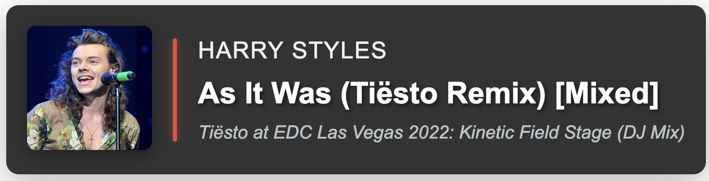

# Webserver Template Gallery

All HTML templates use WebSockets (prefixed with `ws-`) for real-time updates that stay in sync
with your stream. Templates are typically named with `fade` or `nofade`:

* **nofade**: stays on screen for the duration of the song
* **fade**: appears when the song changes, then fades out

For a complete list of templates, see the [Template Reference](../reference/templates.md).

## Examples

### ws-basicblack

`ws-basicwhite`, `ws-basicblue`, and `ws-basicyellow` use the same layout with different color schemes.

### ws-mtv-nofade

### ws-mtv-fade

### ws-mtv-cover-nofade

### ws-mtv-cover-fade

### ws-cover-title-artist

### ws-cookie-cutter-dj

### ws-unoriginal-dj-clone

### ws-typing-classic

### ws-spinblack

### ws-anime-elastic

