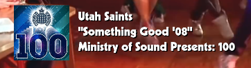

# What's Now Playing - DJ Streaming Software

**Automatically display live track information from your DJ software on streams, in chat, and anywhere your
audience can see it.**

What's Now Playing connects to your DJ software and eliminates the need to manually update song titles during
live streams, radio shows, or DJ sets. Focus on your music while your audience stays informed about every track
you play.

## DJ Software Integration

Works with all major platforms. See the full [Input Sources](input/index.md) list for details.

* Serato DJ
* Traktor
* Virtual DJ
* Denon DJ (StagelinQ)
* djay Pro
* DJUCED
* JRiver Media Center
* [MIXXX](input/mixxx.md)
* Icecast streaming servers — including [butt](input/icecast.md#settings-for-butt) and other Icecast sources
* Remote input — including [MegaSeg](input/remote.md#megaseg) and [Radiologik](input/remote.md#radiologik)
* M3U playlists
* MPRIS2-compatible players (Linux)
* Windows Media API (Windows Media Player, Spotify, SoundCloud, Amazon Music, and more)

## Stream Platforms

* **Twitch** - Full chat bot with song requests, announcements, and the Guess Game
* **Kick** - Song announcement support
* **OBS Studio** - Professional track displays and browser sources
* **Discord** - Community server integration

## Audience Engagement

* **[Guess Game](output/guessgame.md)** - Twitch chat hangman-style game where viewers guess the current track
* **[Track Requests](requests.md)** - Let viewers request tracks directly from Twitch chat
* **[Charts](output/charts.md)** - Share what you're playing with the whatsnowplaying.com community

## Enhanced Metadata

* Automatically identify untagged tracks with audio fingerprinting
* Enrich displays with artist biographies and background information
* Add high-quality album artwork and fan art images
* Detailed track and artist information from Discogs, MusicBrainz, and more

## Flexible Output

* Simple text files for basic integration
* Custom HTML templates for professional displays
* Real-time WebSocket streams for dynamic content
* Direct OBS integration with browser sources
* Template system for complete customization

## See It In Action

Create professional displays that rival music television:

Check out the [gallery](gallery.md) to see more examples and get inspiration for your setup!

## Get Started

Begin with the [Quickstart Guide](quickstart.md) to connect your DJ software and get up and running.
