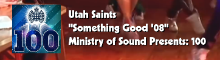

# What's Now Playing - DJ Streaming Software

**Automatically display live track information from your DJ software on streams, in chat, and anywhere your
audience can see it.**

What's Now Playing connects to your DJ software and eliminates the need to manually update song titles during
live streams, radio shows, or DJ sets. Focus on your music while your audience stays informed about every track
you play.

## Perfect for Streaming DJs

**DJ Software Integration:**

Works with all major platforms including:

* Serato DJ
* Traktor
* Denon DJ (StagelinQ)
* Virtual DJ
* DJUCED
* MIXXX
* JRiver Media Center
* And many more

**Stream Platforms:**

* **Twitch** - Full chat bot with song requests and announcements
* **Kick** - Song announcement support
* **OBS Studio** - Professional track displays and browser sources
* **Discord** - Community server integration

**Enhanced Metadata:**

* Automatically identify untagged tracks with audio fingerprinting
* Enrich displays with artist biographies and background information
* Add high-quality album artwork and images
* Provide detailed track and artist information

**Flexible Output:**

* Simple text files for basic integration
* Custom HTML templates for professional displays
* Real-time WebSocket streams for dynamic content
* Direct OBS integration with browser sources
* Template system for complete customization

## See It In Action

Create professional displays that rival music television:

Check out the [gallery](gallery.md) to see more examples and get inspiration for your setup!

## Get Started

Ready to automate your track displays? Begin with the [Quickstart Guide](quickstart.md) to connect your DJ
software and start streaming like a pro.
