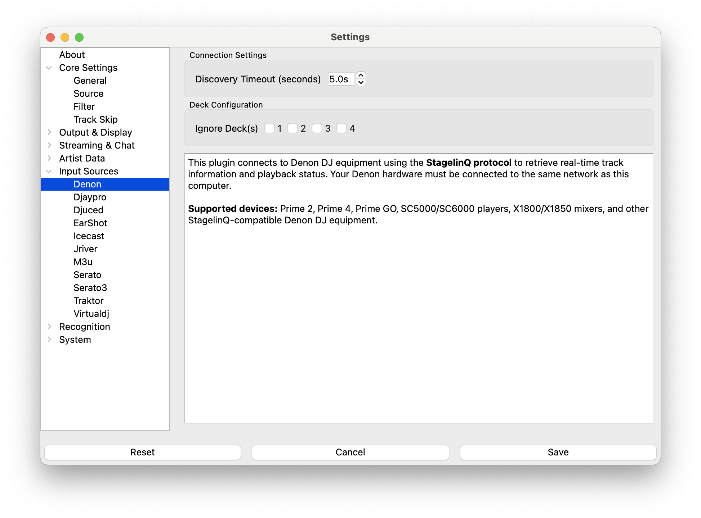

# Denon DJ

> NOTE: Both Newest and Oldest mix modes are supported.

Connects directly to Denon DJ equipment over your network to get real-time track information.

## Supported Equipment

- Denon DJ standalone all-in-ones (Prime 2, Prime 4, Prime Go/Go+, SC Live 2/4, Mixstream Pro series)
- Denon DJ standalone players (SC5000/SC5000M, SC6000/SC6000M)
- Other StagelinQ-compatible Denon DJ equipment

Denon DJ mixers (X1800/X1850 Prime) do not need to be configured: they push fader and crossfader
information to the connected players automatically, and **What's Now Playing** reads it from there.

## Instructions

1. Ensure your Denon DJ equipment and computer are on the same network
2. Open Settings from the **What's Now Playing** icon
3. Select Core Settings->Source from the left-hand column
4. Select Denon DJ from the list of available input sources
5. Select Input Sources->Denon from the left-hand column

## Setup

1. **Discovery Timeout** - How long to wait for devices (default: 5 seconds)
2. **Deck Skip** - Check decks to ignore during track detection
3. Click Save

## Multiple Players

**What's Now Playing** connects to every Denon DJ player and all-in-one it finds on the network
at the same time, so setups such as two SC6000s with a mixer work out of the box.

With more than one player, deck numbers are assigned by the player number set on each unit
(Engine OS preferences, shown on the jog display), then by layer:

| Player | Layer | Deck number |
|--------|-------|-------------|
| 1      | A     | 1           |
| 1      | B     | 2           |
| 2      | A     | 3           |
| 2      | B     | 4           |

A single all-in-one keeps its usual deck 1-4 numbering. The **Deck Skip** checkboxes refer to
these numbers, so with two players, "Deck 3" means player 2's layer A. If a player leaves the
network, the remaining decks are renumbered, so double-check deck skip settings if you change
your setup mid-show.

> NOTE: Give each unit a **distinct player number**. If two players are both left at the
> default of 1, deck numbering falls back to an arbitrary order and a warning is logged.

## How It Works

**What's Now Playing** monitors all decks and selects the track your audience is actually
hearing based on fader positions, crossfader state, and play status.

- **All-in-one units** report their own fader and crossfader positions.
- **Players with a Denon DJ mixer** (X1800/X1850) receive per-deck volume from the mixer;
  no direct mixer connection is needed.
- **Players with a third-party or analog mixer** provide no volume information, so every
  playing deck is treated as audible and selection falls back to play status and mix mode.

## Troubleshooting

### No Devices Found

- Verify both devices are on the same network
- Try increasing the Discovery Timeout setting
- Restart **What's Now Playing**
- Check firewall settings

### Wrong Track Detected

- Check deck skip settings
- Verify fader positions (very low faders are ignored)
- Try switching between "newest" and "oldest" mix modes
- With an analog or third-party mixer, fader positions are unavailable: stop or pause decks
  that should not be reported

### Connection Issues

- Use wired network connection if possible
- Update Denon DJ firmware
- **What's Now Playing** will automatically reconnect
