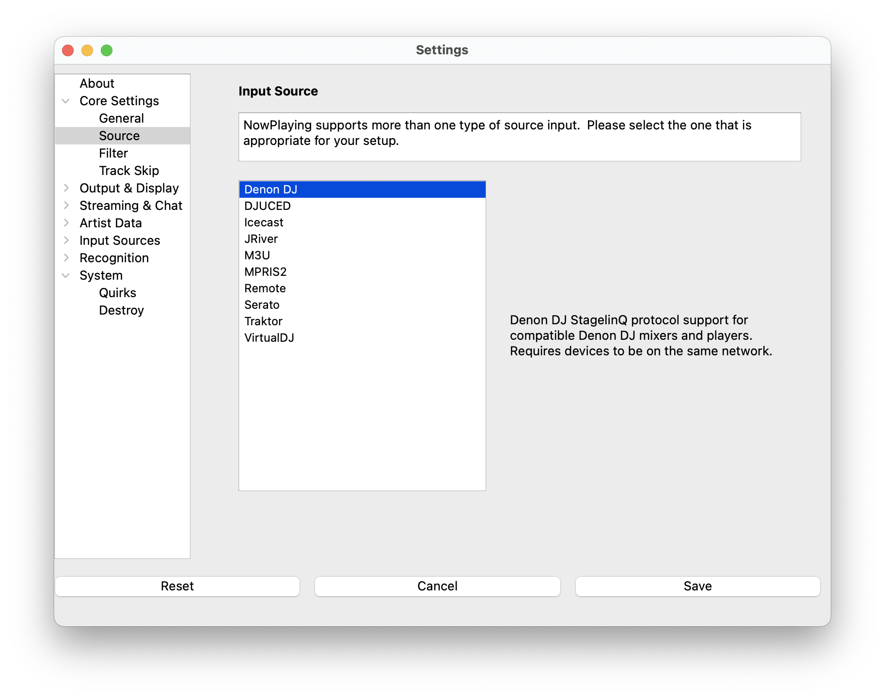

# Denon DJ

> NOTE: Both Newest and Oldest mix modes are supported.

Connects directly to Denon DJ equipment over your network to get real-time track information.

## Supported Equipment

- Denon DJ Prime series mixers (Prime 2, Prime 4, Prime Go/Go+)
- Denon DJ standalone players (SC5000, SC6000)
- Other StagelinQ-compatible Denon DJ equipment

## Instructions

1. Ensure your Denon DJ equipment and computer are on the same network
2. Open Settings from the **What's Now Playing** icon
3. Select Core Settings->Source from the left-hand column
4. Select Denon DJ from the list of available input sources
5. Select Input Sources->Denon from the left-hand column

## Setup

1. **Discovery Timeout** - How long to wait for devices (default: 5 seconds)
2. **Deck Skip** - Check decks to ignore during track detection
3. Click Save

## How It Works

What's Now Playing monitors all decks and selects the track your audience is actually hearing based on fader
positions, crossfader state, and play status.

## Troubleshooting

### No Devices Found

- Verify both devices are on the same network
- Try increasing the Discovery Timeout setting
- Restart What's Now Playing
- Check firewall settings

### Wrong Track Detected

- Check deck skip settings
- Verify fader positions (very low faders are ignored)
- Try switching between "newest" and "oldest" mix modes

### Connection Issues

- Use wired network connection if possible
- Update Denon DJ firmware
- What's Now Playing will automatically reconnect
