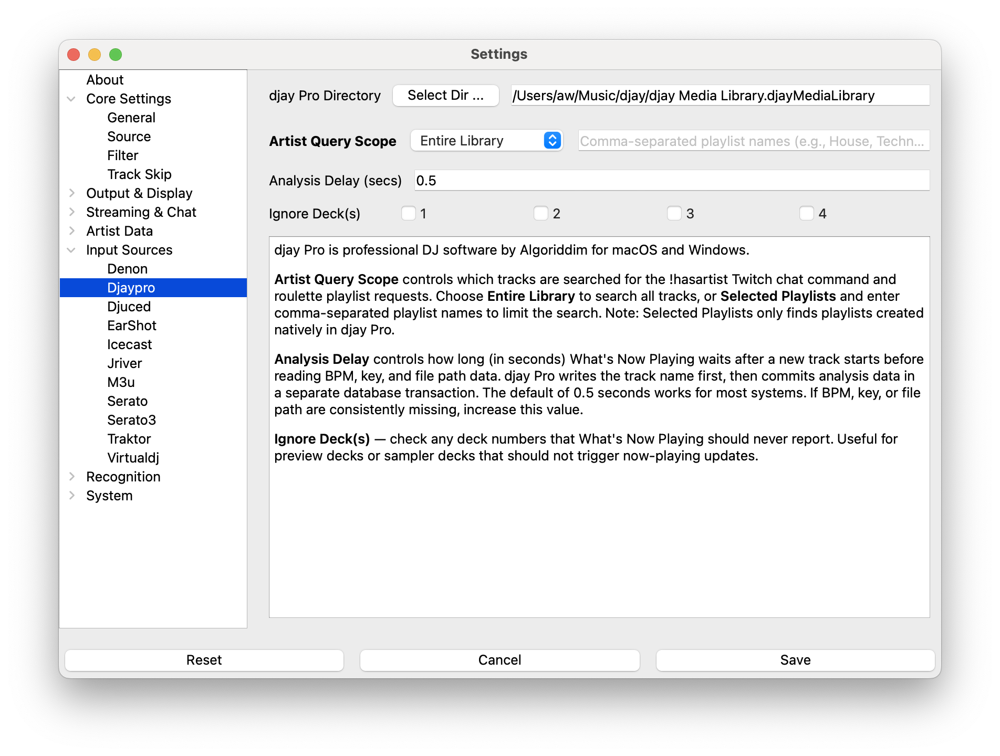

# djay Pro Support

djay Pro is DJ software by Algoriddim available for macOS and Windows.

> NOTE: Only tested with djay Pro 5.x on macOS and Windows
>
> NOTE: iOS and Android versions are not supported

## Instructions

1. Open Settings from the **What's Now Playing** icon
2. Select Core Settings->Source from the left-hand column
3. Select djay Pro from the list of available input sources

1. Select Input Sources->djay Pro from the left-hand column
2. Enter or, using the button, select the directory where the djay Pro media library is located
   * macOS: `~/Music/djay/djay Media Library.djayMediaLibrary`
   * Windows: `%USERPROFILE%\Music\djay\djay Media Library`
3. Click Save

## Settings

### Artist Query Scope

Controls which tracks are searched for the `!hasartist` Twitch chat command and roulette playlist
requests. Choose **Entire Library** to search all tracks, or **Selected Playlists** and enter
comma-separated playlist names to limit the search to specific playlists.

> NOTE: **Selected Playlists** only searches playlists created natively in djay Pro. Playlists
> from iTunes/Music or other sources are not visible to this feature.

### Analysis Delay

djay Pro writes the new track name immediately but commits BPM, key, and file path data in a
separate database transaction that arrives shortly after. **Analysis Delay** controls how long
(in seconds) What's Now Playing waits for that second write before reporting the track.

The default of `0.5` seconds works for most systems. If BPM, key, or the file path are
consistently missing, increase the value. On fast NVMe storage you may be able to lower it.

Note that the file path is also required for What's Now Playing to read tags stored in the audio
file itself (cover art, ISRC, MusicBrainz IDs, and other metadata not kept in djay Pro's
database). If the file path is missing, those tags will not be available.

### Ignore Deck(s)

Check the deck numbers you want What's Now Playing to ignore. Tracks played on ignored decks
are never reported. Useful for preview decks or sampler decks that should not trigger
now-playing updates.

## Metadata provided

* Artist, title, duration
* Album (macOS only)
* BPM and musical key (from djay Pro's own analysis, when available)
* Deck number
* Filename / file path (local tracks only)

## Troubleshooting

If tracks are not being detected:

1. Verify the djay Pro media library directory path is correct
2. Check that djay Pro is actively playing tracks
3. Ensure the MediaLibrary.db file exists in the configured directory
4. Try playing a few tracks to populate the play history
5. Check the **What's Now Playing** logs for database connection errors

If BPM, key, or file path are missing:

* Increase the **Analysis Delay** setting — djay Pro may be writing analysis data slower than
  the default 0.5 s wait on your hardware
* BPM and key are only available after djay Pro has analysed the track; newly imported tracks
  may not have this data yet
