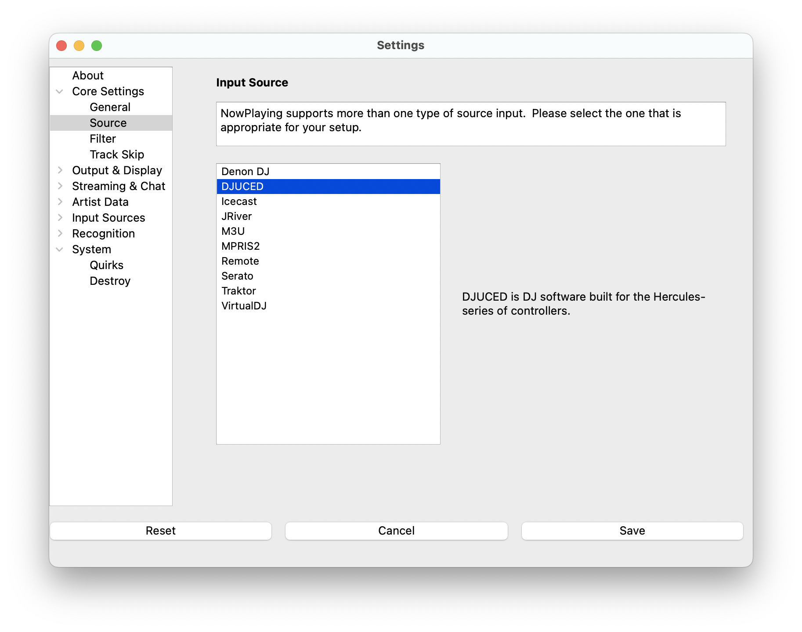

# DJUCED Support

DJUCED is DJ software built by Guillemot Corporation for their line of
Hercules controllers.

> NOTE: This source does not support Oldest mix mode.
>
> NOTE: Only tested with DJUCED 6.0.1

## Instructions

1. Open Settings from the **What's Now Playing** icon
2. Select Core Settings->Source from the left-hand column
3. Select DJUCED from the list of available input sources

1. Select Input Sources->DJUCED from the left-hand column
2. Enter or, using the button, select the directory where the DJUCED
   files are located.
3. Configure artist query scope for the !hasartist command - either entire library or specific playlists (comma-separated)
4. Click Save

1. In DJUCED, go to Settings -> Record and turn on Text File Output
2. Change the Format to be: `%TI% | %DE% | %AR% | %AL%`
3. Use the default filename `playing.txt` and save it in the DJUCED directory
