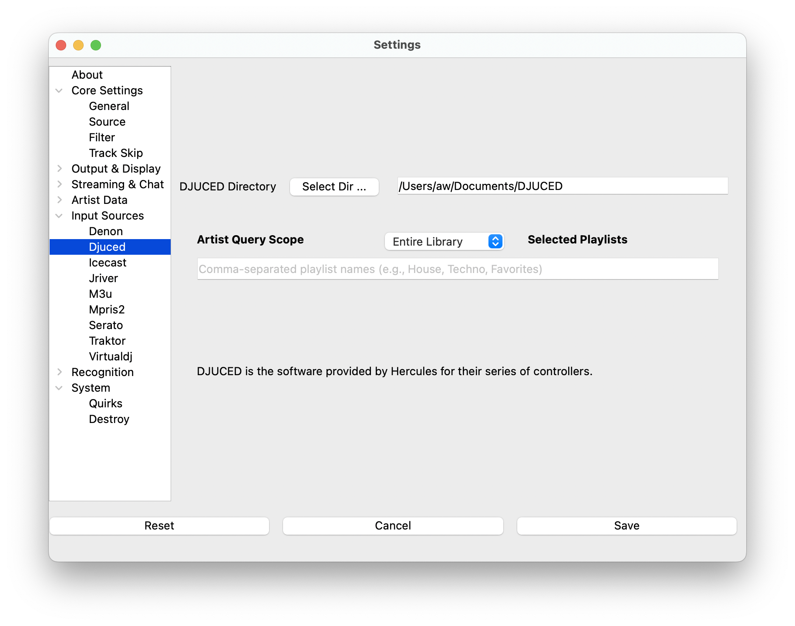
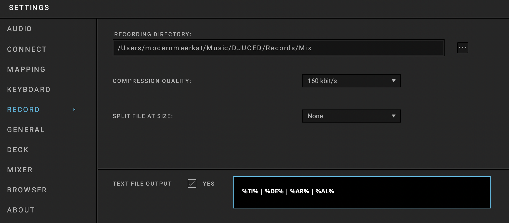

# DJUCED Support

\*\* Experimental \*\*

DJUCED is DJ software built by Guillemot Corporation for their line of
Hercules controllers.

> NOTE: This source does not support Oldest mix mode.
>
> NOTE: Only tested with DJUCED 6.0.1

## Instructions

1. Open Settings from the **What's Now Playing** icon
2. Select Input Source from the left-hand column
3. Select the DJUCED from the list of available input sources.

1. Select DJUCED from the left-hand column.
2. Enter or, using the button, select the directory where the DJUCED
   files are located.

1. Click Save
2. In DJUCED, go into Settings -\> Record. Turn on Text File Output.
3. Change the Format to be: `%TI% | %DE% | %AR% | %AL%`

1. The file name of the output file is expected to be the default
    `playing.txt` and as well as stored in the DJUCED directory.
