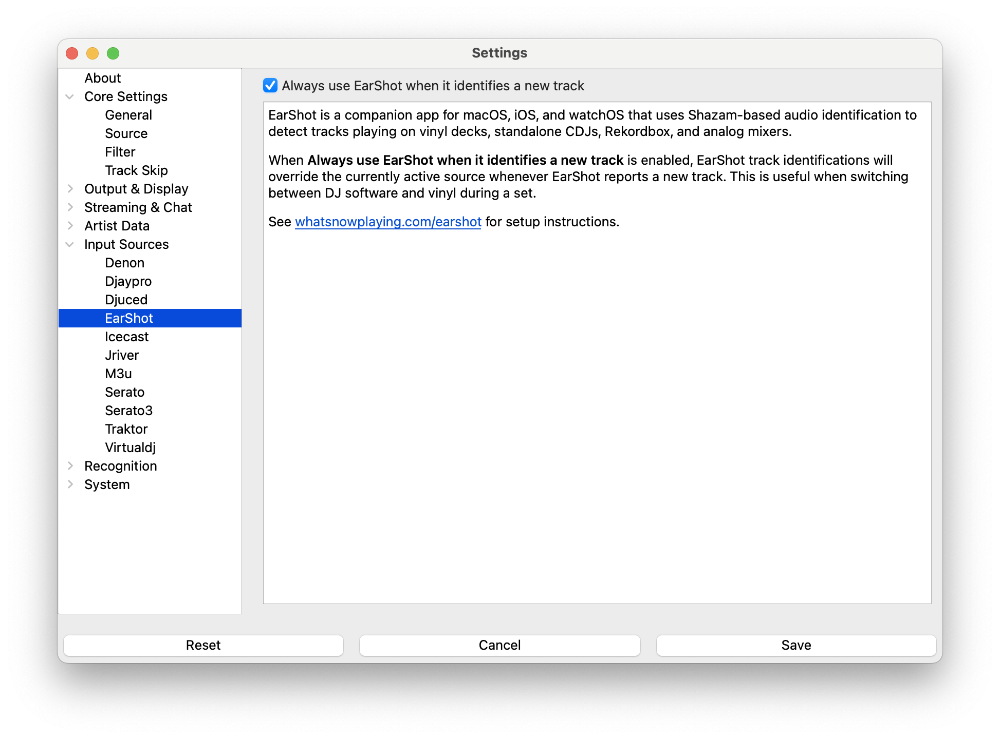

# WNP EarShot

WNP EarShot is a companion app for macOS, iOS, and watchOS that uses Shazam-based
audio identification to detect tracks playing on vinyl decks, standalone CDJs,
Rekordbox, and analog mixers, then sends them to **What's Now Playing** over
the local network.

> NOTE: WNP EarShot must be installed and configured separately. See the
> [WNP EarShot website](https://whatsnowplaying.com/earshot) for installation instructions.

## Setup

### Select EarShot as the Input Source

1. Open Settings from the **What's Now Playing** icon
2. Select Core Settings->Source from the left-hand column
3. Select EarShot from the list of available input sources
4. Click Save

This is the right choice when your entire setup is vinyl, CDJs, or an analog
mixer — WNP EarShot is the only source feeding track data.

### Always-Accept Mode

If you mix vinyl or CDJs alongside DJ software (Serato, Traktor, etc.), use
**Always-Accept** mode instead of switching sources:

1. Open Settings from the **What's Now Playing** icon
2. Select Input Sources->EarShot from the left-hand column
3. Check **Always use EarShot when it identifies a new track**
4. Select your DJ software as the active source under Core Settings->Source
5. Click Save

With this enabled, **What's Now Playing** runs a secondary EarShot monitor in
the background. Whenever WNP EarShot identifies a new track that differs from
what the DJ software is reporting, EarShot's identification takes over. Once
your DJ software moves on to a new track, it resumes control automatically.

## How It Works

WNP EarShot sends identified tracks to WNP's remote input endpoint over the
local network. The EarShot source filters incoming remote tracks to only those
originating from WNP EarShot — other remote sources are ignored.

In always-accept mode, WNP compares artist and title between EarShot and the
active DJ software source. If WNP EarShot hears the same track the DJ software
is already reporting (e.g. room audio bleed), it is treated as confirmation,
not an override, so the display does not flicker.

## Troubleshooting

If WNP EarShot identifications are not appearing:

1. Confirm the WNP EarShot app is running and connected to the same local
   network as **What's Now Playing**
2. Verify the WNP webserver is enabled (Output & Display->Web Server) and
   listening on the correct port
3. Check the WNP EarShot app settings to confirm it is pointed at the correct
   WNP host and port
4. Check the **What's Now Playing** logs for incoming remote input activity
