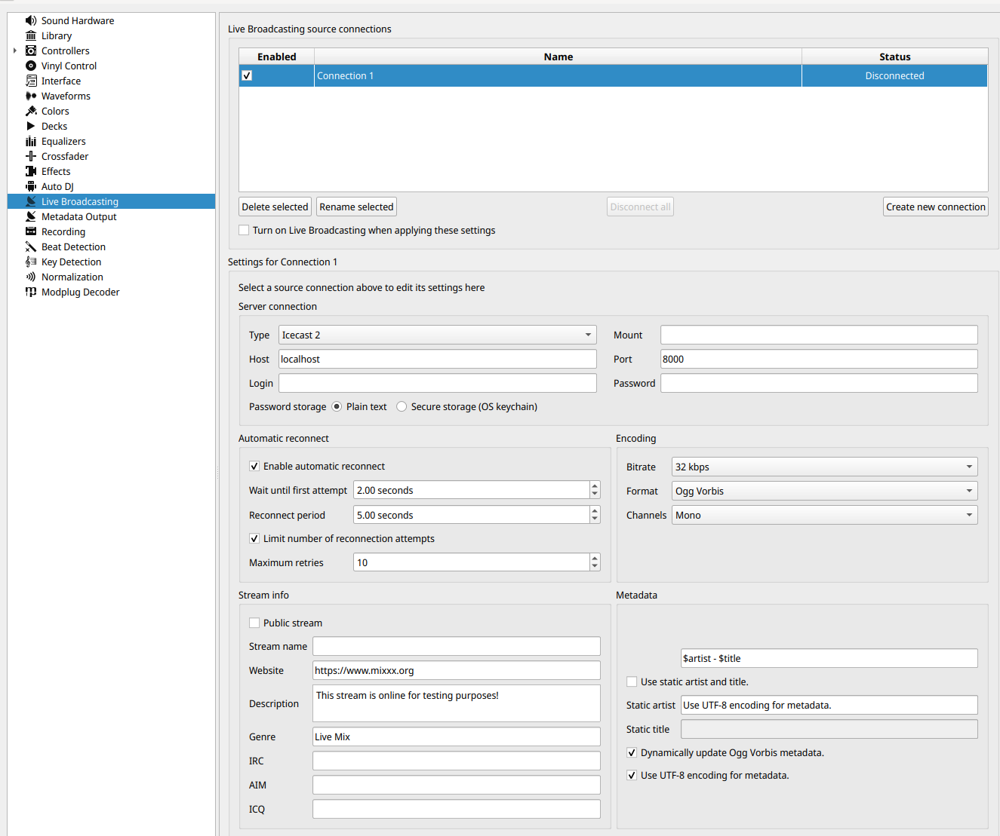

# Icecast

[Icecast](https://icecast.org/) is a popular system to stream audio over
the Internet. It is supported directly by software such as
[MIXXX](https://mixxx.org/) and
[Traktor](https://www.native-instruments.com/en/catalog/traktor) .
Additionally, programs such as [butt](https://danielnoethen.de/butt)
allow one to stream nearly any audio source.

> NOTE: This source does not support Oldest mix mode.
>
> NOTE: Support for Icecast is very experimental.

## Instructions

1. Open Settings from the **What's Now Playing** icon
2. Select Input Source from the left-hand column

1. Select Icecast from the list of available input sources.
2. Select Icecast from the left-hand column.

1. If necessary, change the port from 8000 to another port, such
   as 5001. (Hint: port 8000 appears to be used on macOS.)
2. Click Save
3. If you changed the Icecast port, restart **What's Now Playing**

## Settings For MIXXX

> NOTE: MIXXX allows for significant screen customization. These images
> come from the 'Late Night' setting. Your display may be different.

1. Configure **What's Now Playing** as above
2. In Preferences, go to Live Broadcasting

1. Under Server Connection:
   1. Set the address to 127.0.0.1 for the same machine, otherwise
      change to the IP address of the machine that is running **What's
      Now Playing**. (HINT: IP Address is visible on **What's Now
      Playing**'s Webserver setting page)
   2. Change the Port to match the port in **What's Now Playing**'s
      Iceast settings page.
2. Under Encoding, change the format to be 32 kbps, Ogg Vorbis, Mono.
3. Select 'OK' to exit Preferences
4. Back on the main MIXXX screen, activate Icecast broadcasting:

1. Click the 'On-Air' option. It may appear as above or as an antenna.
2. It should change to a solid color, usually green. On error (there is
   usually a pop-up window), double check all settings in **What's Now
   Playing** and MIXXX to make sure they match.

## Settings for butt

Under Audio, be sure that Ogg Vorbis is selected:

Under Stream, if using the 'Update song name from application', be sure
to use 'Title - Artist' mode.

