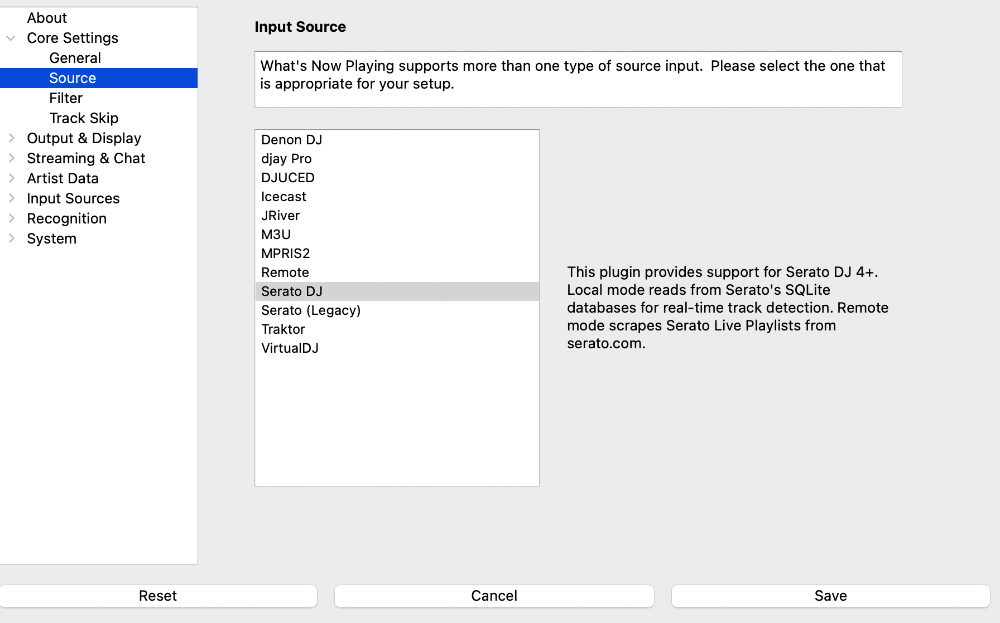

# Source

For **What's Now Playing** to work, it needs to know what software is playing music.
In the UI, this setting is called the Source. There are many sources available — some
require additional configuration, others work automatically once selected. Click on a
source below for more information.

## DJ Software

Professional DJ software with direct integration:

- **[Serato 4+](serato.md)** - Modern Serato DJ 4.0+ integration with auto-detection and SQLite database
- **[Serato 3.x](serato3.md)** - Legacy Serato DJ integration with smart crate support
- **[Traktor](traktor.md)** - Native Instruments Traktor with Icecast streaming + database enhancement
- **[Virtual DJ](virtualdj.md)** - Virtual DJ software with history file monitoring
- **[djay Pro](djaypro.md)** - Algoriddim djay Pro with database and file monitoring (basic support)
- **[DJUCED](djuced.md)** - Hercules DJUCED software integration
- **[Denon](denon.md)** - Denon DJ software integration

## Media Players

General media player software:

- **[JRiver](jriver.md)** - JRiver Media Center with REST API integration
- **[macOS Music](macos_music.md)** - macOS Music app (formerly iTunes) (macOS only)
- **[Windows Media](winmedia.md)** - Windows Media API (Spotify, Amazon Music, and more) (Windows only)
- **[MPRIS2](mpris2.md)** - Linux MPRIS2 media player interface (VLC, etc.) (Linux only)

## Streaming & Files

Network streaming and file-based sources:

- **[Icecast](icecast.md)** - Icecast streaming server metadata
- **[M3U](m3u.md)** - M3U playlist file monitoring
- **[Remote](remote.md)** - Remote input via REST API from other applications
