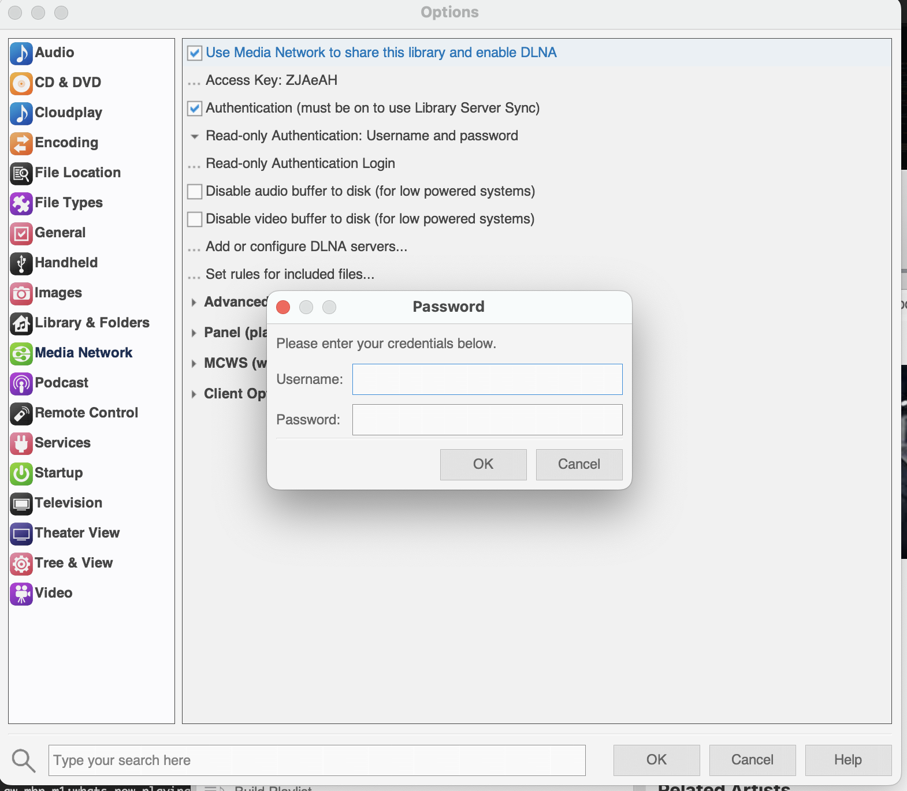
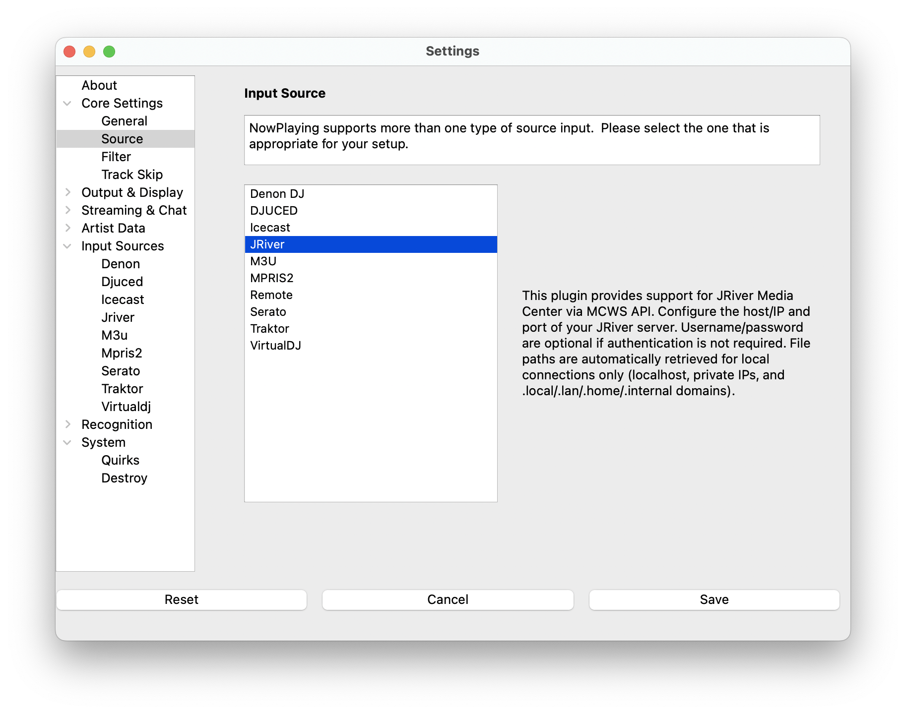

# JRiver

JRiver Media Center is a commercial media player application that runs
on Windows, Mac, and Linux. **What's Now Playing** connects to JRiver
using the MCWS (Media Center Web Service) API to retrieve currently
playing track information.

The JRiver input source supports both local and remote connections to
JRiver Media Center instances. For local connections, **What's Now
Playing** can also retrieve the full file path of the currently playing
track.

> NOTE: This source does not support Oldest mix mode.

## Requirements

- JRiver Media Center (version 20 or later recommended)
- MCWS (Media Center Web Service) enabled in JRiver
- Network connectivity between **What's Now Playing** and JRiver (if
  running on different machines)

## Setup Instructions

### JRiver Configuration

1. Open JRiver Media Center
2. Go to **Tools** → **Options** → **Media Network**
3. Check **Use Media Network to share this library**

1. Note the **Access Key** if one is displayed (optional but
   recommended for security)

1. Configure authentication if desired:
   - Check **Require authentication for requests**
   - Set a **Username** and **Password**

1. Note the **Port** number under Advanced and in some of the previous
   displays (default is 52199)
2. Click **OK** to save settings

### What's Now Playing Configuration

1. Open Settings from the **What's Now Playing** icon
2. Select **Input Source** from the left-hand column
3. Select **JRiver** from the list of available input sources
4. Select **JRiver** from the left-hand column to configure settings

## Configuration Options

Host/IP Address
The hostname or IP address of the machine running JRiver Media Center.

- Use `localhost` or `127.0.0.1` if JRiver is on the same machine
- Use the IP address (e.g., `192.168.1.100`) for remote connections
- IPv6 addresses are supported and will be automatically formatted
  correctly

Port
The port number for MCWS connections (default: `52199`)

Username (Optional)
Username for authentication if required by JRiver

Password (Optional)
Password for authentication if required by JRiver

Access Key (Optional)
Access key for additional security validation if configured in JRiver

## Connection Types

### Local Connections

Local connections are automatically detected for:

- `localhost`, `127.0.0.1`, `::1`
- Private IP addresses (192.168.x.x, 10.x.x.x, 172.16.x.x)
- Local domain patterns (`.local`, `.lan`, `.home`, `.internal`)

For local connections, **What's Now Playing** will attempt to retrieve
the full file path of the currently playing track, which can be useful
for other applications or logging.

### Remote Connections

Remote connections are used for all other hostnames and public IP
addresses. File paths are not retrieved for remote connections for
security reasons.

## Testing Your Connection

You can test your JRiver MCWS configuration by opening a web browser and
visiting:

`http://[host]:[port]/MCWS/v1/Alive`

For example: `http://localhost:52199/MCWS/v1/Alive`

This should return an XML response showing your JRiver server
information if the connection is working correctly.

## Troubleshooting

### Connection Failed

- Verify JRiver Media Center is running
- Check that Media Network is enabled in JRiver settings
- Ensure the correct host/IP address and port are configured
- For remote connections, verify network connectivity and firewall
  settings

### Authentication Failed

- Verify username and password are correct (if authentication is
  enabled)
- Check that the access key matches (if configured)
- Ensure authentication is properly enabled in JRiver if credentials are
  provided

### No Track Information

- Ensure music is currently playing in JRiver
- Check that JRiver is not paused
- Verify the MCWS API is responding by testing the connection URL in a
  browser

### File Path Not Available

File paths are only available for local connections. Remote connections
will not include file path information for security reasons.

## Supported Track Information

The JRiver input source provides the following track metadata:

- **Artist** - Track artist name
- **Album** - Album name
- **Title** - Track title
- **Duration** - Track length in seconds
- **Filename** - Full file path (local connections only)

Additional track metadata may be available depending on how the tracks
are tagged in JRiver.
