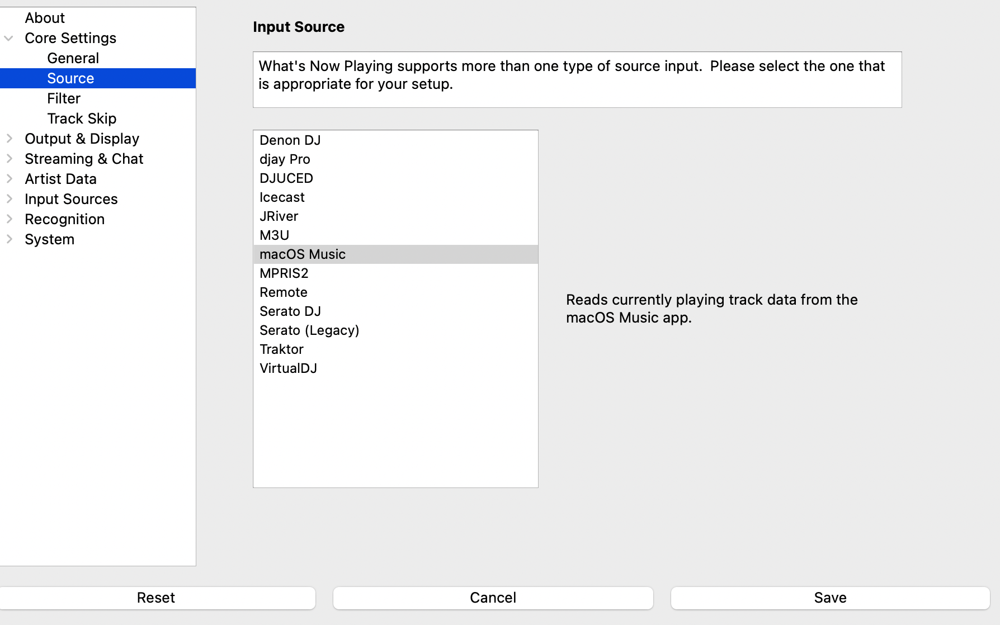

# macOS Music

Reads currently playing track data from the macOS Music app (formerly iTunes).

## Requirements

* macOS only
* The Music app must be open and playing

## Instructions

1. Open Settings from the **What's Now Playing** icon
2. Select Core Settings->Source from the left-hand column
3. Select **macOS Music** from the list of available input sources

No additional configuration is required.

## What's Provided

* Title, artist, album, genre, year
* BPM, comments, disc and track numbers
* File path (for locally stored tracks)
* Cover artwork

## Limitations

* Only works with the macOS Music app — other players such as Spotify are not supported
* Playback must be active; paused or stopped tracks are not reported
