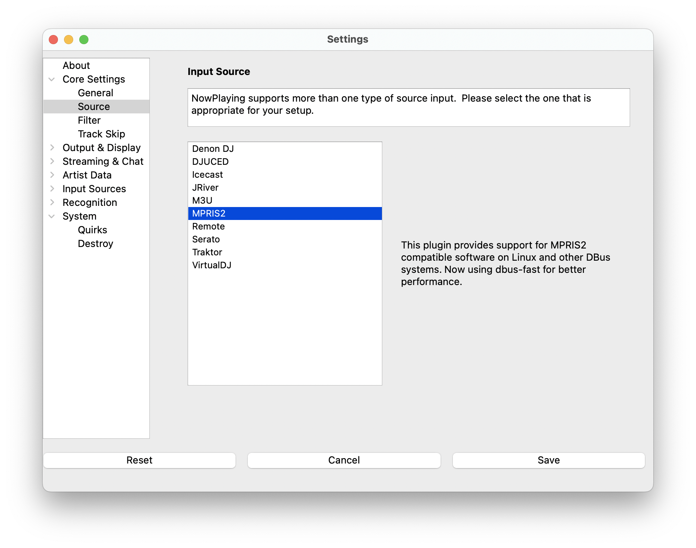

# MPRIS2

[MPRIS2](https://mpris2.readthedocs.io/en/latest/) is a specification
for Linux DBus compatible music software to communicate with each other.
**What's Now Playing** supports reading track data from MPRIS2 sources,
including VLC.

> NOTE: This source does not support Oldest mix mode.

## Instructions

1. Open Settings from the **What's Now Playing** icon
2. Select Input Source from the left-hand column

1. Select the MPRIS2 from the list of available input sources.
2. Select MPRIS2 from the left-hand column.
3. Select from the detected MPRIS2 sources. Closing and re-opening the
   Settings UI will update the list.

1. Click Save
