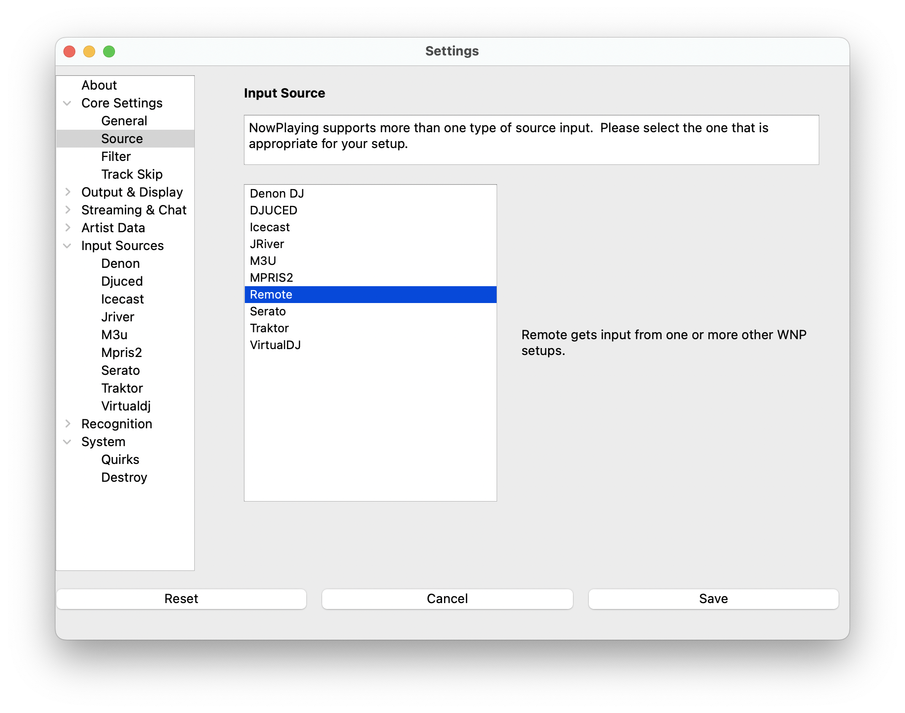
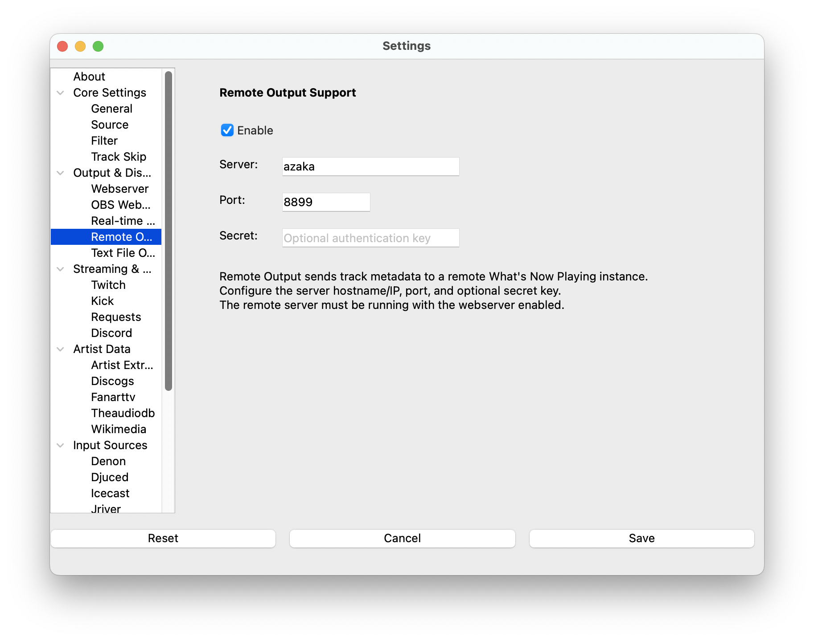

# Remote Services

A common streaming configuration is to have more than one computer
involved, such as one computer working as the DJ machine and one computer
for processing the stream.  In some very advanced configurations, there
might even be more than one DJ on different computers swapping back and
forth!

**What's Now Playing** supports a configuration where each setup has
their own app configuration running.  One or more installations on
DJ computers send the track information to a central one.  That
central one will then perform any additional lookups and send the
output to anything configured such as Twitch.

## Instructions

### Server Side

[](images/remote-source-selection.png)

1. Open Settings from the **What's Now Playing** icon
2. Select Core Settings->Source from the left-hand column
3. Select Remote from the list of available input sources
4. Configure the [webserver](../output/webserver.md) and optionally set a secret

### Client Side

[](images/remote-source-settings.png)

1. Open Settings from the **What's Now Playing** icon
2. Select Output & Display->Remote Output from the left-hand column
3. Enable it
4. Choose your connection method:
   * **Auto-discover** (Recommended): Check the "Auto-discover server" checkbox and the client will
     automatically find the server on your local network using Bonjour/Zeroconf
   * **Manual**: Enter the server's hostname or IP address and port number
5. Set Secret if the server has one configured
6. Configure your DJ software as usual (Core Settings->Source and Input Sources)

> NOTE: Auto-discovery only works on the local network. For remote connections across the
> internet, you must use manual configuration.

> NOTE: Some content, such as cover art, will not be sent to the remote server.

## Client Configuration Notes

Turn off these services on client computers to avoid conflicts:

- Artist Extras
- Discord
- Kick Chat
- Twitch (Chat and Requests)

Recognition services (like AcoustID) must run on the client computer since they need local file access.

## DJ Software Integration Examples

Some DJ software can send track information directly to What's Now Playing via HTTP requests:

**MegaSeg (Logging → Send track info to server):**

```url
http://localhost:8899/v1/remoteinput?title=%Title%&artist=%Artist%&album=%Album%&year=%Year%&duration=%LengthSeconds%&bpm=%BPM%&composer=%Composer%&lyricist=%Lyricist%&publisher=%Publisher%
```

**Radiologik (Publishing → Network & Serial → GET URL):**

```url
http://localhost:8899/v1/remoteinput?title=<t>&artist=<a>&album=<l>&isrc=<i>&composer=<comp>&publisher=<p>&year=<y>&duration=<s>&comment=<c>
```

> Replace `localhost:8899` with your server's hostname and webserver port.
> If a secret is configured, add `&secret=your_secret_key` to the URL.

## Advanced API Usage

For detailed API documentation including request/response formats, authentication, and validation details, see the [API Reference](../reference/api.md#getpost-v1remoteinput).
