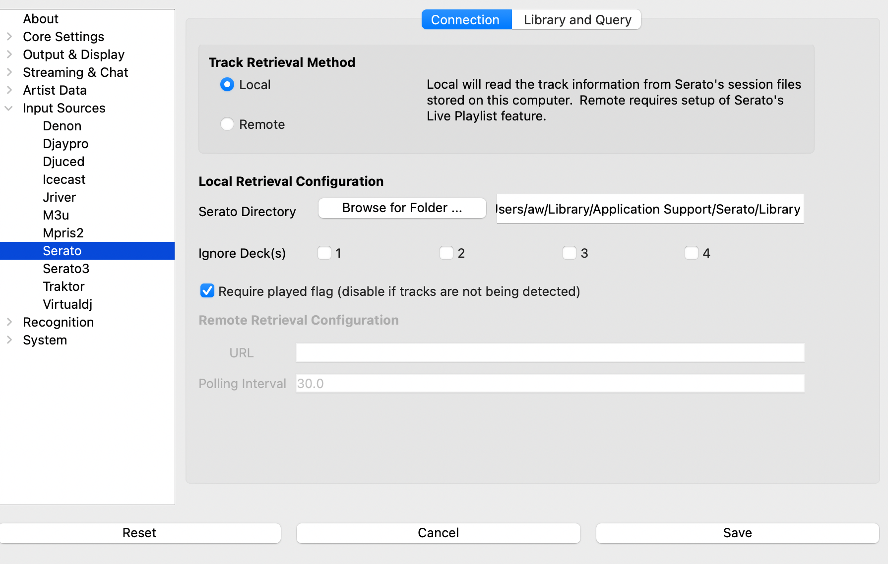

# Serato 4+

> Using older Serato versions? See [Serato 3.x](serato3.md)

## Setup

1. Open Settings from the **What's Now Playing** icon
2. Select Core Settings->Source from the left-hand column
3. Select "Serato" from the list of available input sources
4. Select Input Sources->Serato from the left-hand column

## Configuration

### Local Mode (Recommended)

Select **Local** if **What's Now Playing** runs on the same computer as Serato:

* **Database Status**: Shows whether your Serato library was found automatically
* **Ignore Deck(s)**: Check any decks you want to skip (1, 2, 3, 4)
* **Require played flag**: When enabled (default), only tracks that Serato has marked as played
  are detected. Disable this if tracks are loaded onto a deck but are not being detected — some
  Serato configurations do not set the played flag correctly. Requires a restart to take effect.
* **Mix Mode**:
  * **Newest**: Show the most recently started track
  * **Oldest**: Show the longest-playing track

No other setup is required - the plugin finds your Serato library automatically.

### Remote Mode

Select **Remote** if **What's Now Playing** runs on a different computer than Serato:

1. **In Serato**: Enable Live Playlists
   * Go to Setup → Expansion Pack tab
   * Check "Enable Live Playlists"
   * Click "Start Live Playlist" in the History panel

2. **In your web browser**: Make the playlist public
   * Serato opens your Live Playlist webpage
   * Click "Edit Details"
   * Change visibility to "Public"
   * Copy the playlist URL

3. **In What's Now Playing**:
   * Paste the URL into the URL field
   * Set polling interval (30 seconds is recommended)

> **Note:** Remote mode only provides artist and title information.

## Artist Query Configuration

The Serato plugin supports artist-based library queries for the `!hasartist` Twitch chat command and
roulette playlist features.

### Artist Query Scope

Choose where **What's Now Playing** searches for artists:

* **Entire Library**: Searches all tracks in your Serato library
* **Selected Playlists**: Searches only specific crates (enter comma-separated crate names in the field)

### Library Paths (Auto-Discovered)

Library paths are automatically discovered from Serato's database. All external drives and music
collections that Serato knows about will be used for artist queries automatically — no manual
configuration needed.

## Troubleshooting

### "No Serato 4+ installation found"

* Make sure Serato DJ Pro/Lite 4.0+ is installed
* Run Serato at least once after installation
* Restart **What's Now Playing**

### Tracks not showing up

* Make sure tracks are actually playing (not just loaded)
* Check that your crossfader isn't cutting off the track
* Verify your DJ controller is working properly in Serato
* If tracks are loaded but never detected, try disabling **Require played flag** in the
  Connection settings — some Serato configurations do not set this flag correctly

### Tracks updating slowly

* Go to Settings → Quirks
* Enable "Use Polling Observer"
* Set polling interval to 1.0 seconds
