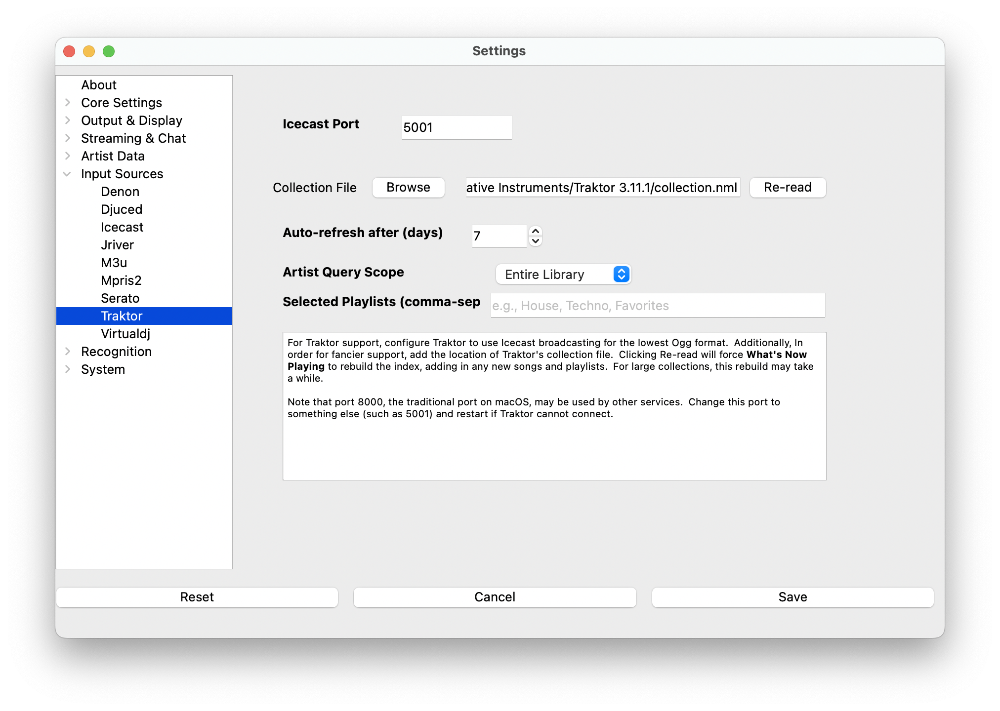

# Traktor

> NOTE: This source does not support Oldest mix mode.

The Traktor input source is a specialized version of the [icecast
source](icecast.md) that also provides access to playlists for
[Request support](../requests.md) .

1. Locate the 'collections.nml' from your Traktor installation
   directory.
2. Click Re-read to rebuild **What's Now Playing**'s copy of Traktor's
   database so that more metadata is available. For extremely large
   Traktor databases, this update may take a while. This extra data is
   required for roulette Requests.
3. After adding more songs to Traktor, click Re-read again to update
   **What's Now Playing** data.
4. In Traktor's Preferences, go to Broadcasting

1. Under Server Settings:
   1. Set the address to 127.0.0.1 for the same machine, otherwise
      change to the IP address of the machine that is running **What's
      Now Playing**. (HINT: IP Address is visible on **What's Now
      Playing**'s Webserver setting page)
   2. Change the Port to match the port in **What's Now Playing**'s
      Iceast settings page.
   3. Change the format to be Ogg Vorbis, 11025 Hz, 32 kBit/s
2. Close Preferences
3. Back on the main Traktor screen, to activate Icecast broadcasting:

1. Click on the reel on the right-hand side (labeled 1 above)
2. Click on the antenna near the middle (labeled 2 above)
3. The antenna should change to a solid color. If it flashes, then
   double check all settings in **What's Now Playing** and Traktor to
   make sure they match.
