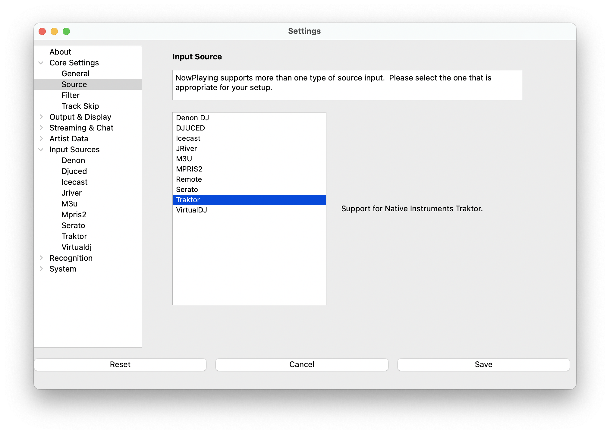

# Traktor

> NOTE: This source does not support Oldest mix mode.

Traktor support combines Icecast streaming with local database enhancement
to provide rich metadata and playlist access.

## How It Works

1. **Traktor broadcasts** basic track info (artist/title) via Icecast stream
2. **What's Now Playing receives** the Icecast stream
3. **Database lookup** enriches the basic stream data with full metadata from your Traktor collection
4. **Enhanced metadata** includes album, filename, and other details not available in the stream

## Instructions

1. Open Settings from the **What's Now Playing** icon
2. Select Core Settings->Source from the left-hand column
3. Select Traktor from the list of available input sources

## Setup

### Step 1: Configure Traktor Broadcasting

In Traktor's Preferences, go to Broadcasting:

Under Server Settings:

1. **Address**: 127.0.0.1 (same machine) or IP of What's Now Playing machine
2. **Port**: Match the port set in What's Now Playing (default: 8000)
3. **Format**: Ogg Vorbis, 11025 Hz, 32 kBit/s

### Step 2: Activate Broadcasting

In Traktor's main interface:

1. Click the reel icon (labeled 1)
2. Click the antenna icon (labeled 2)
3. Antenna should turn solid color (flashing = connection problem)

### Step 3: Configure What's Now Playing

1. Select Input Sources->Traktor from the left-hand column
2. Set the **Port** to match what you'll configure in Traktor (default: 8000)
3. **Browse** for your Traktor `collection.nml` file
   - Usually in `Documents/Native Instruments/Traktor Pro 3/` or similar
4. Click **Re-read** to build the database (may take time for large collections)
5. Set **Max age** for automatic database refreshes (default: 7 days)

## Troubleshooting

- **No enhanced metadata**: Check that collection.nml path is correct and Re-read completed
- **Connection issues**: Verify port numbers match between Traktor and What's Now Playing
- **Slow database building**: Normal for large collections (10,000+ tracks)
