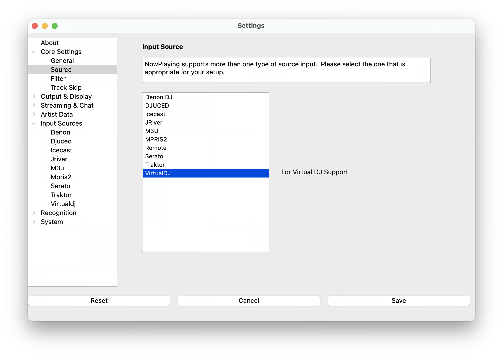
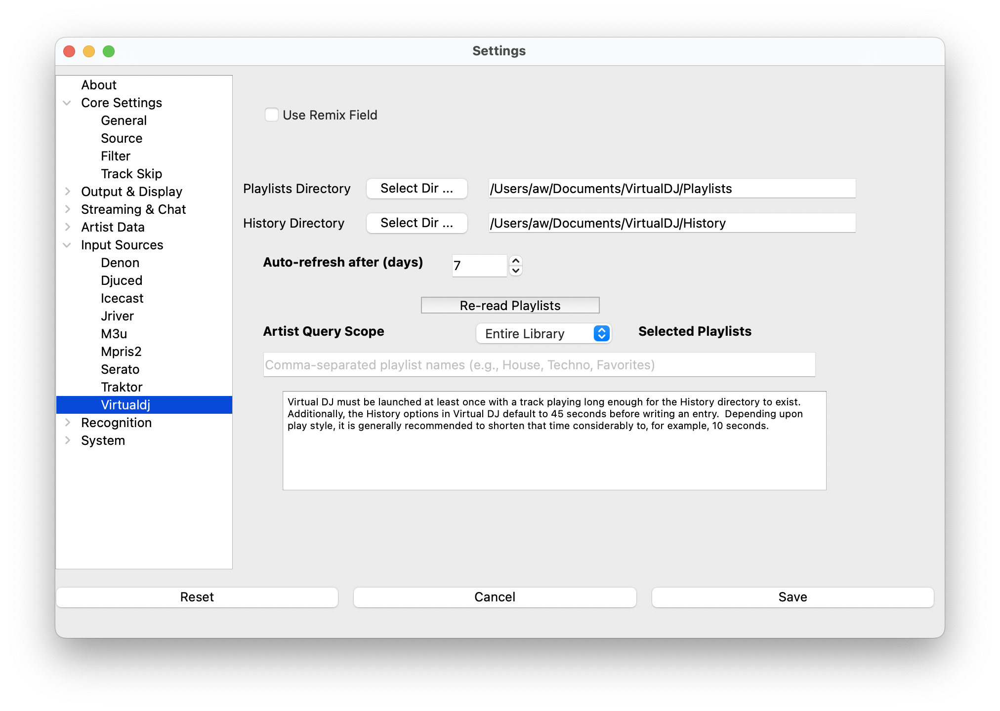

# Virtual DJ

> NOTE: This source does not support Oldest mix mode.

## Instructions

1. Open Settings from the **What's Now Playing** icon
2. Select Core Settings->Source from the left-hand column
3. Select Virtual DJ from the list of available input sources
4. Select Input Sources->Virtual DJ from the left-hand column

## Setup

### Configure Directories

1. **History Directory** - Usually auto-detected as `Documents/VirtualDJ/History`
2. **Playlists Directory** - Usually auto-detected as `Documents/VirtualDJ/Playlists`
3. Use **Select Dir** buttons if paths need adjustment

### Database Settings

1. Click **Re-read** to build the metadata database
2. Set **Max age** for automatic database refreshes (default: 7 days)
3. **Use Remix Field** - Filters out remix data (recommended)

## Troubleshooting

### No Track Updates

- Check that History directory path is correct
- Ensure VirtualDJ is writing history files (play tracks long enough)

### No Enhanced Metadata

- Click **Re-read** to build database from VirtualDJ's collection

### Playlist Requests Not Working

- Ensure Playlists directory is correct
- Click **Re-read** after making playlist changes in VirtualDJ
- Playlist files only update when VirtualDJ is closed

### Changing Metadata

If What's Now Playing acts erratic when changing metadata in VirtualDJ:

1. Pause What's Now Playing from the menu
2. Make your metadata changes in VirtualDJ
3. Play the next track
4. Unpause What's Now Playing
