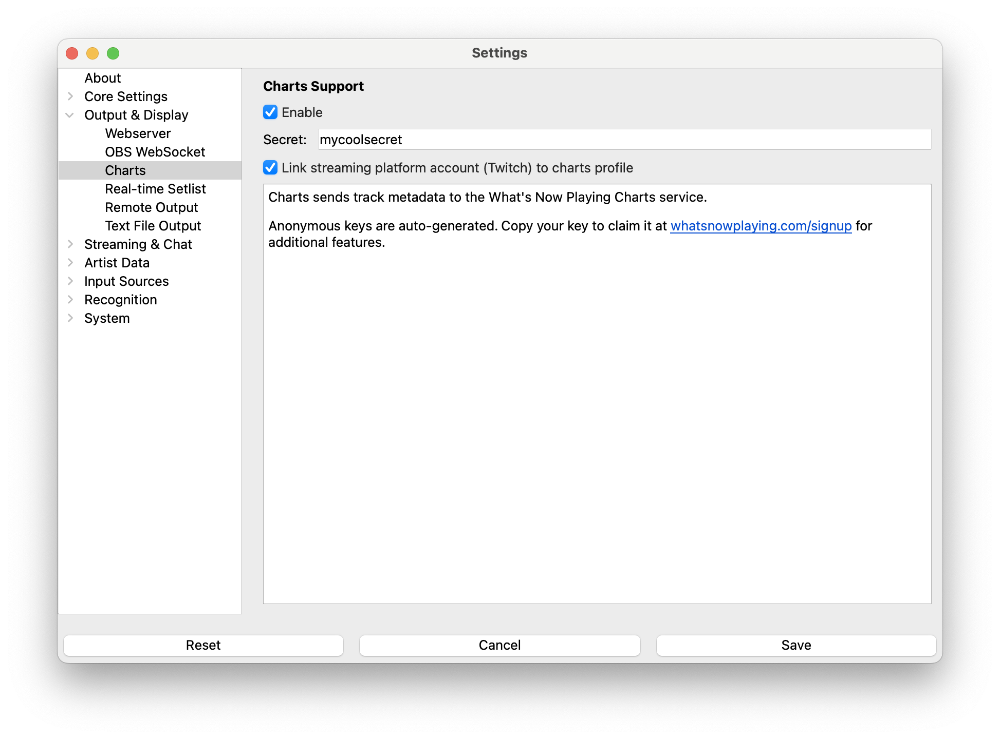

# Charts

Charts sends track metadata to the What's Now Playing Charts service for tracking, analytics, and
access to online features.

## What it provides

The Charts output automatically submits your track information to the What's Now Playing Charts service.
Basic anonymous tracking starts immediately. No account is required. Claiming your key at
whatsnowplaying.com unlocks a public profile page and additional features.

### Anonymous Tracking (No Account Required)

* Play history is recorded immediately after first startup
* Data is stored anonymously under your auto-generated key
* No signup needed to start collecting data

### With a Claimed Charts Account

Once you claim your key (see below), your profile page at
`https://whatsnowplaying.com/profile/(your-username)` shows:

* **Play statistics**: total plays, unique songs, and unique artists since you started streaming
* **Top 10 Tracks** and **Top 10 Artists**: most-played songs and artists with play counts
* **DJ Profile**: auto-generated genre analysis with top-level genres and subgenre percentages
* **DJ Setlists**: downloadable setlists from recent streams in multiple formats, with configurable
  visibility (public, followers only, subscribers only, or private)
* **Recent Tracks**: a chronological feed of your latest tracks with artist, album, and timestamp

See your profile page on <https://whatsnowplaying.com/signup> for the full view.

### Features Requiring a Charts Account

* **[Online Guess Game Board](guessgame.md#online-game-board)**: a public web page at
  `https://whatsnowplaying.com/guessgame/(your-username)` that shows your active guess game,
  masked track/artist, live leaderboards, and game status, shareable with your viewers

## Automatic Setup

Charts is **enabled by default** and requires no manual configuration. **What's Now Playing** automatically:

* Generates an anonymous API key during first startup
* Begins tracking your music immediately
* Stores your key securely for future sessions

## Claiming Your Anonymous Key

To access advanced features and view your data online:

1. Navigate to **Output & Display** → **Charts**
2. Copy your auto-generated **Secret Key** from the input field
3. Visit <https://whatsnowplaying.com/signup> to create an account
4. Sign up using **Twitch** or **Kick** credentials
5. Once logged in, enter your copied key to claim it and link it to your account

## Configuration

* **Enable** - Turn Charts output on or off (enabled by default)
* **Secret** - Your auto-generated anonymous API key (automatically created)

## How it works

When enabled, the Charts plugin:

* Automatically sends track metadata when songs change
* Queues submissions when the service is temporarily unavailable
* Retries failed submissions automatically
* Excludes sensitive information (filenames, system data, etc.)
* Only sends essential track data (artist, title, album, etc.)

## Queue System

The Charts plugin includes a robust offline queue system:

* **Automatic queuing** - Track updates are queued if the Charts service is down
* **Persistent storage** - Queued items survive application restarts
* **Automatic retry** - Failed submissions are retried when the service comes back online
* **Secure storage** - Authentication keys are never stored in queue files

## Troubleshooting

* **Authentication failed** - Verify your secret key is correct
* **Connection errors** - Check your internet connection
* **Invalid request data** - Ensure you're using a supported **What's Now Playing** version

The Charts service processes standard track metadata including artist, title, album, genre, and timing information.
Personal data like file paths and system information are automatically excluded from submissions.
