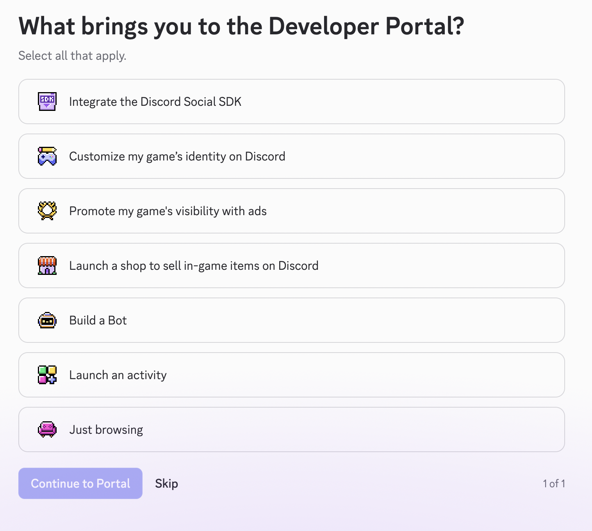
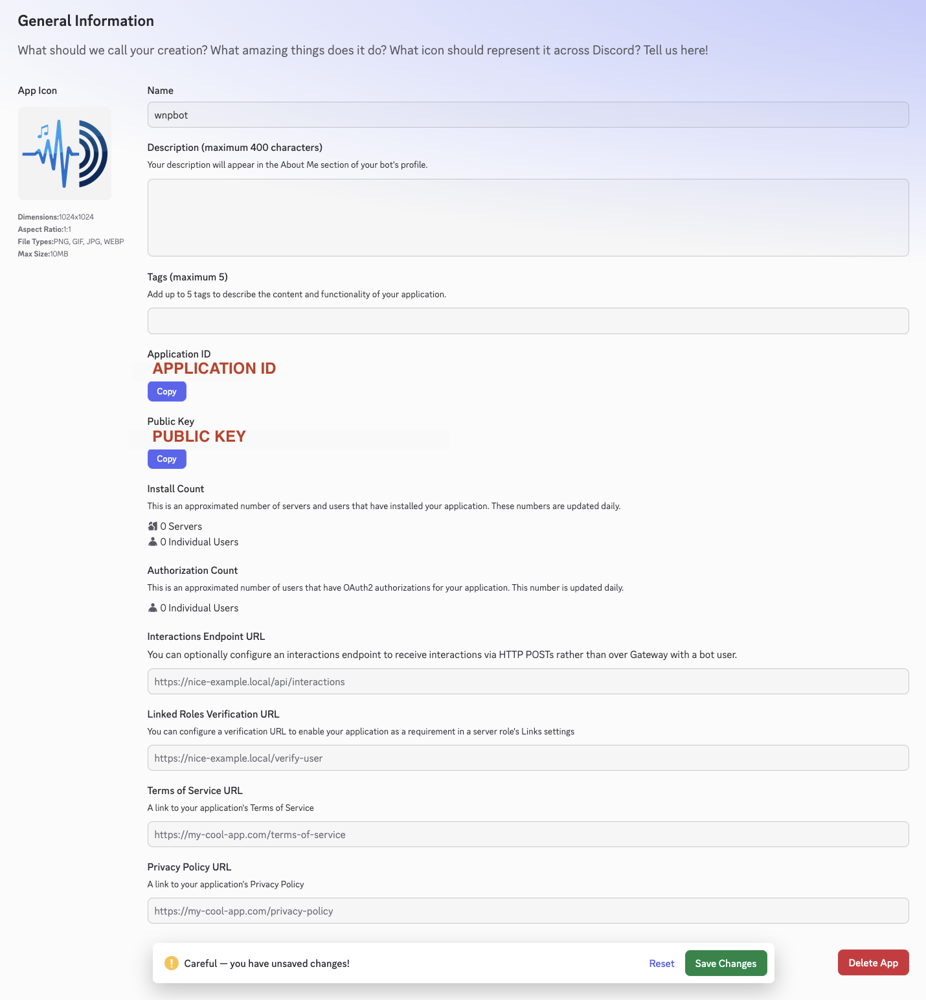
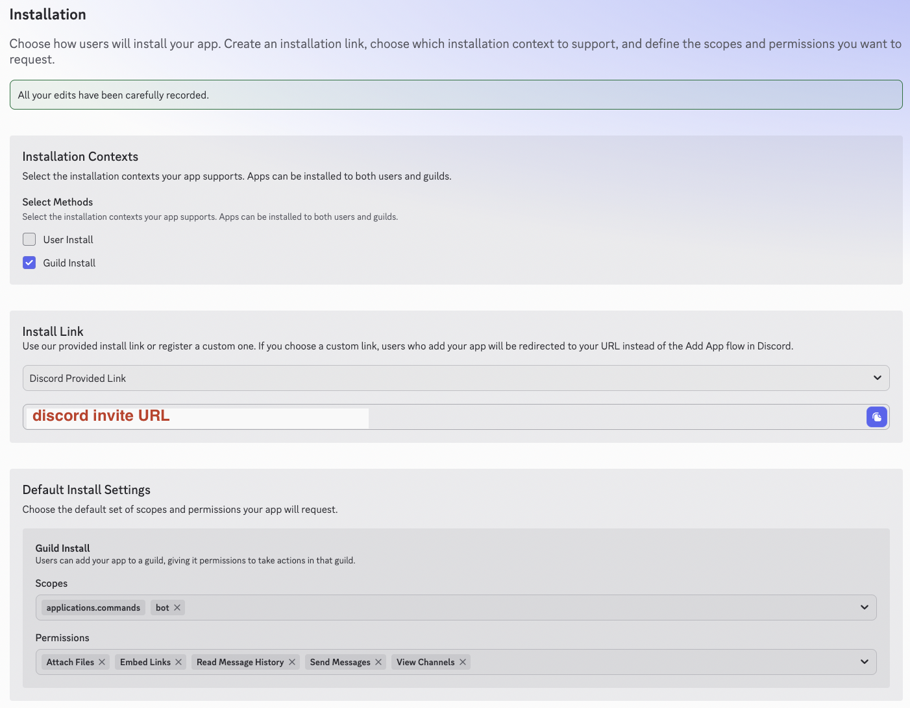
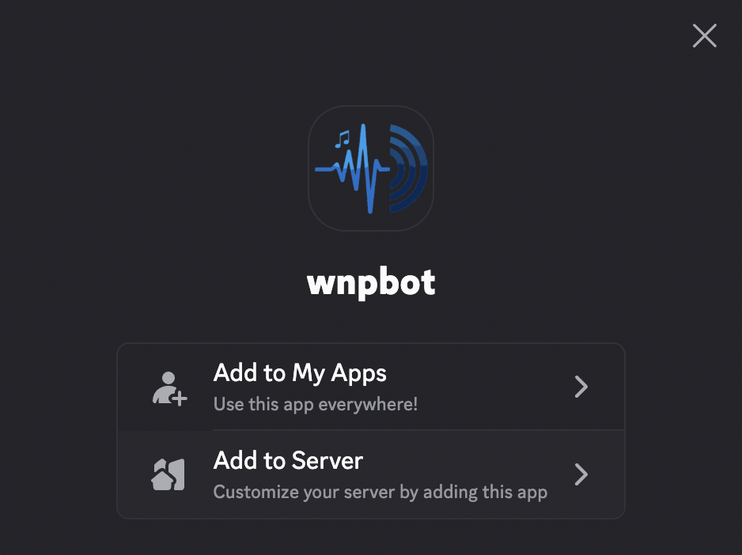

# Discord

**What's Now Playing** supports two Discord modes, which can run simultaneously:

* **Bot Mode**: A bot account joins your Discord server and updates its presence with
  the currently playing track, optionally linking to your Twitch stream.
* **Client Mode**: Updates your own Discord user's Rich Presence status via the
  Discord desktop app running on the same machine.

## What's Now Playing Configuration

1. Open Settings from the **What's Now Playing** icon
2. Select **Discord** from the **Streaming & Chat** section
3. Check **Enable**
4. Select the template to use for the status text
5. Fill in the **Client ID** and/or **Bot Token** fields depending on which modes you want
6. Click **Save** and restart **What's Now Playing**

## Bot Mode Setup

Bot Mode connects a bot account to your Discord server and updates its presence with the
currently playing track. If Twitch is also configured and enabled, the presence will show
as a Twitch stream link.

### Step 1: Go to the Discord Developer Portal

Go to <https://discord.com/developers/applications>. If this is your first time, you may
see a "What brings you to the Developer Portal?" onboarding screen.

Select **Build a Bot** and click **Continue to Portal**.

### Step 2: Create a New Application

Click **New Application** in the upper right corner.

Give your application a name (e.g., `wnpbot`), agree to the Developer Terms of Service,
and click **Create**. You may be asked to complete a CAPTCHA.

### Step 3: Note Your Application ID

You will land on the **General Information** page.

Copy the **Application ID**. You will need this for Client Mode. For Bot Mode only, you
can skip this for now.

### Step 4: Get a Bot Token

In the left sidebar, click **Bot**.

Click **Reset Token**. Discord will ask you to log in again to confirm. After authenticating,
the token will be displayed once. Copy it immediately, as you cannot view it again without
regenerating it. No privileged intents are required for **What's Now Playing**.

### Step 5: Invite the Bot to Your Server

In the left sidebar, click **Installation**.

Under **Installation Contexts**, make sure only **Guild Install** is checked (not User Install).

Under **Default Install Settings → Guild Install**, set the **Scopes** to include `bot`
and set the following **Permissions**:

* View Channels
* Send Messages
* Embed Links
* Attach Files
* Read Message History

Copy the **Discord Provided Link** and open it in a browser.

Click **Add to Server**.

Select your server from the dropdown and click **Authorize**. You must have **Manage
Server** permission in the server to add a bot.

### Step 6: Configure What's Now Playing

Paste the bot token into the **Bot Token** field in **What's Now Playing**'s Discord
settings. Click **Save** and restart. The bot will appear in your server and begin
updating its presence as tracks change.

## Client Mode Setup

Client Mode updates your own Discord Rich Presence status using the Discord desktop app
running locally on the same machine. The Discord app must already be running before
**What's Now Playing** starts. If it isn't, Client Mode will not connect. Restart
**What's Now Playing** after launching Discord.

### Step 1: Create an Application and Get a Client ID

Follow Steps 1–3 from Bot Mode above to create an application. The **Application ID**
shown on the General Information page is your Client ID.

### Step 2: Configure What's Now Playing

Paste the Application ID into the **Client ID** field in **What's Now Playing**'s Discord
settings. No bot token, no server invite, and no privileged intents are needed for Client
Mode.

Click **Save** and restart **What's Now Playing**.
