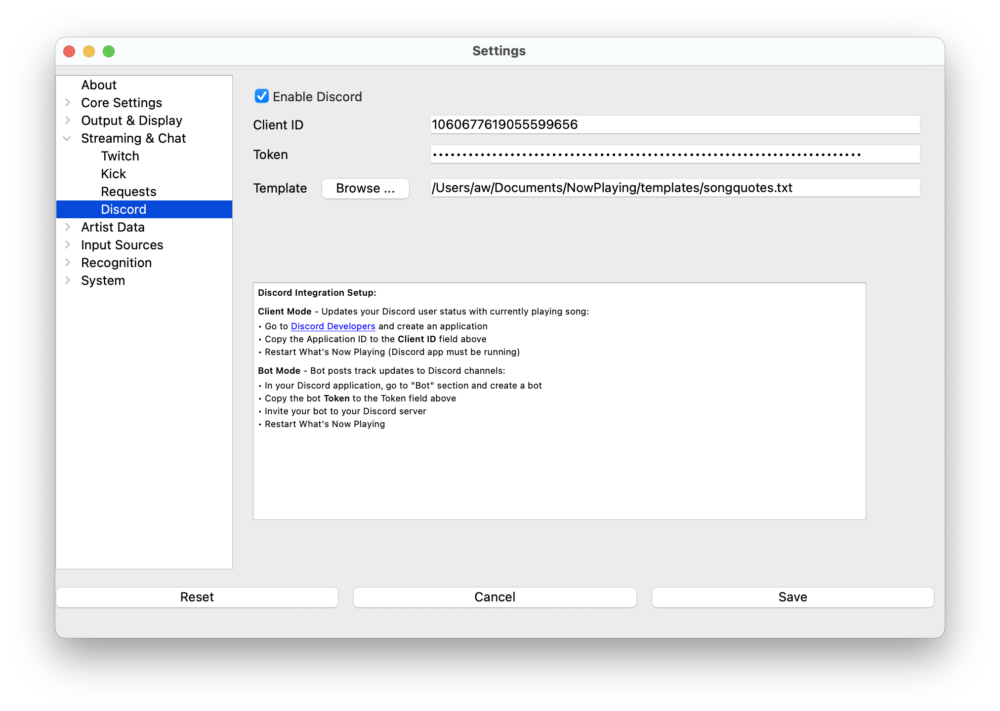

Discord
=========

**What's Now Playing**'s support of Discord is very preliminary at the moment.  It supports
updating the activity of a bot account with a template.

#. Go to your `Discord Developers <https://discord.com/developers/>`_ page
#. Create an application
#. Build-a-bot
#. Make a note of the token from the bot page
#. Invite your bot to your Discord channel
#. In **What's Now Playing**
#. Enable Discord
#. Put that token into the Discord settings
#. Select an appropriate template
#. Save
