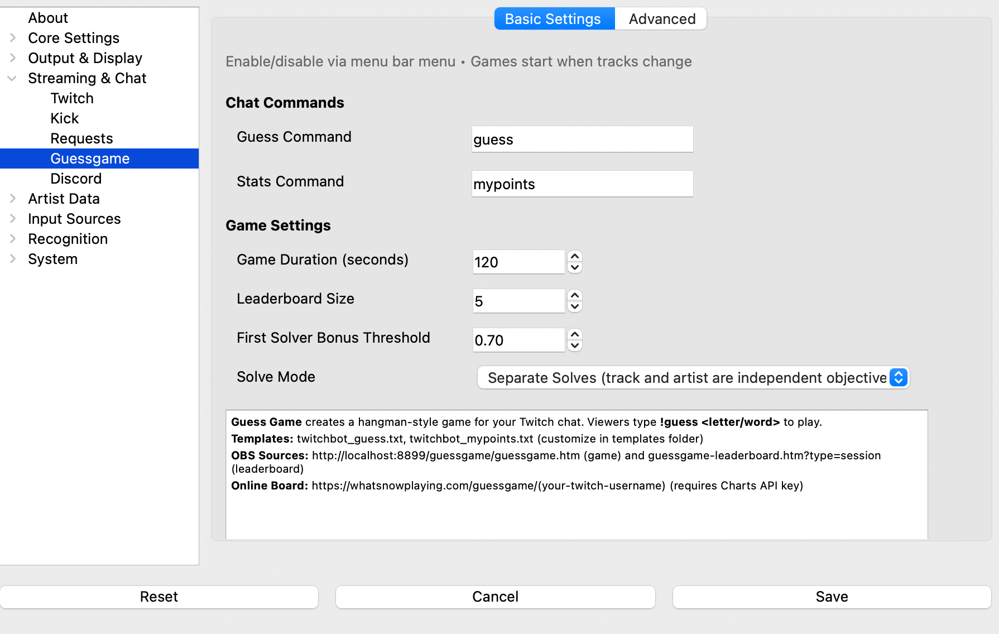
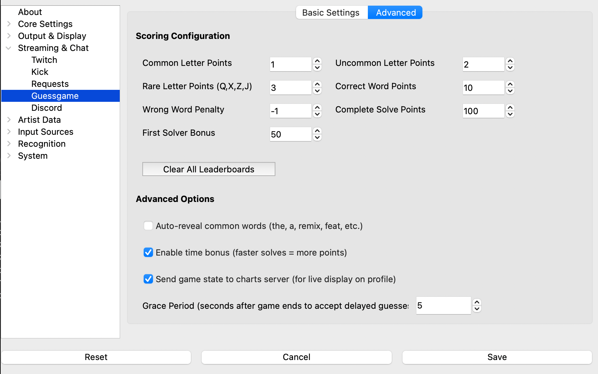

# Guess Game

**What's Now Playing** includes an interactive hangman-style game that runs in your Twitch chat, allowing
viewers to guess the currently playing track and artist. Players earn points for correct guesses, with a
leaderboard system to track top performers across your stream session and all-time.

## What It Provides

* **Interactive Chat Game**: Viewers type commands like `!guess e` or `!guess house` to play
* **Automatic Announcements**: Bot announces new games in chat when tracks change
* **Real-time OBS Display**: Shows masked track/artist names and game state in your stream overlay
* **Online Game Board**: Optional web display at whatsnowplaying.com with Charts API integration
* **Leaderboard System**: Tracks both session and all-time scores with configurable size
* **Flexible Solve Modes**: Configure whether viewers must guess track, artist, or both
* **Smart Scoring**: Points awarded based on letter frequency (rare letters = more points)
* **Automatic Games**: New games start when your track changes and end after a configurable duration
* **User Statistics**: Players can check their stats with a customizable command (default: `!mypoints`)

## Setup

### Prerequisites

Before enabling the Guess Game, you must have:

1. **Twitch Bot configured**: See [TwitchBot](twitchbot.md) for authentication setup
2. **Webserver enabled**: See [Webserver](webserver.md) for configuration

### Enabling the Guess Game

**macOS:**

1. Click the **What's Now Playing** menu bar icon
2. Check **Enable Guess Game**

**Windows:**

1. Right-click the **What's Now Playing** system tray icon
2. Check **Enable Guess Game**

**Linux:**

1. Click the **What's Now Playing** system tray icon
2. Check **Enable Guess Game**

### Configuration

1. Open Settings from the **What's Now Playing** menu/tray icon
2. Select **Guess Game** from the list of settings available
3. Configure the settings on each tab:

#### Basic Settings Tab

[](images/guessgame_basic.png)

| Setting | Description | Default |
|---------|-------------|---------|
| Guess Command | Chat command viewers use to submit guesses | `guess` |
| Stats Command | Chat command viewers use to check their statistics | `mypoints` |
| Game Duration | Maximum time in seconds before game times out | `120` (2 minutes) |
| Leaderboard Size | Number of top players shown on leaderboard | `10` |
| First Solver Bonus Threshold | Difficulty threshold (0.0-1.0) for awarding first solver bonus | `0.70` |
| Solve Mode | How the game determines completion (see below) | Separate Solves |

**Solve Modes:**

* **Separate Solves**: Track and artist are independent objectives (players can solve one without the other)
* **Either**: Exact match of track OR artist wins the entire game
* **Both Required**: Players must guess both track AND artist together to win

#### Advanced Tab

[](images/guessgame_advanced.png)

**Scoring Configuration:**

| Setting | Description | Default |
|---------|-------------|---------|
| Common Letter Points | Points for guessing common letters (e, a, o, etc.) | `1` |
| Uncommon Letter Points | Points for guessing uncommon letters (d, h, etc.) | `2` |
| Rare Letter Points | Points for guessing rare letters (x, z, q, etc.) | `3` |
| Correct Word Points | Points for guessing a correct word in track/artist | `10` |
| Wrong Word Points | Penalty for guessing an incorrect word | `-1` |
| Complete Solve Points | Bonus for completely solving track or artist | `100` |
| First Solver Bonus | Additional bonus for being first to solve (on difficult tracks) | `50` |

**Advanced Options:**

| Setting | Description | Default |
|---------|-------------|---------|
| Auto Reveal Common Words | Automatically reveal very common words (the, and, of, etc.) | Disabled |
| Time Bonus Enabled | Award bonus points for solving quickly | Disabled |
| Send to Server | Enable online game board at whatsnowplaying.com (requires Charts API key) | Enabled |
| Grace Period | Seconds after game ends to still accept guesses (accounts for Twitch stream delay) | 5 |

**Leaderboard Management:**

* **Clear All Leaderboards** button: Permanently deletes all user scores (session and all-time)

## OBS Integration

The Guess Game provides two OBS browser sources for displaying game information on your stream:

### Game Display

Shows the current game state with masked track/artist names:

1. Add a **Browser** source in OBS
2. Set URL to: `http://localhost:8899/guessgame/guessgame.htm`
3. Set dimensions: `1920x200` (or adjust to your layout)
4. Customize the display by editing `templates/guessgame/guessgame.htm`

**Display Shows:**

* Masked track name (e.g., `h___e __ _he ___i__ s__`)
* Masked artist name (e.g., `_he __i__ls`)
* Time remaining in seconds
* Guessed letters list
* Game status (Active, Solved, Timeout, Waiting)

### Leaderboard Display

Shows top players for session or all-time using a single unified template with URL parameters:

#### Session Leaderboard

Displays scores for the current streaming session:

1. Add a **Browser** source in OBS
2. Set URL to: `http://localhost:8899/guessgame/guessgame-leaderboard.htm?type=session`
3. Set dimensions: `600x800` (or adjust to your layout)

#### All-Time Leaderboard

Displays cumulative scores across all sessions:

1. Add a **Browser** source in OBS
2. Set URL to: `http://localhost:8899/guessgame/guessgame-leaderboard.htm?type=all_time`
3. Set dimensions: `600x800` (or adjust to your layout)

**Customization:**

Both leaderboards use the same template file (`templates/guessgame/guessgame-leaderboard.htm`), making it easy
to maintain consistent styling. The `?type=session` or `?type=all_time` URL parameter controls which data is
displayed and which color scheme is used (purple/orange for session, green for all-time).

**Both Leaderboards Show:**

* Rank (with gold/silver/bronze styling for top 3)
* Username
* Total score
* Number of solves

## How It Works

### Game Flow

1. **Track Changes**: When a new track starts playing, the Guess Game automatically begins
2. **Chat Announcement**: An automatic announcement is sent to Twitch chat when the game starts
3. **Chat Commands**: Viewers type `!guess <letter or word>` in Twitch chat
4. **Guess Processing**:
    * **Single letters**: Revealed if present in track/artist, points awarded by frequency
    * **Words**: Checked against track/artist name, bonus points if correct
    * **Complete matches**: If track/artist fully matches, that objective is solved
5. **Game Ends**: When solved or time expires, game ends and scores are saved
6. **Next Track**: Process repeats for the next song

### Guess Normalization

The game intelligently handles variations in guesses:

* **Case insensitive**: `HOUSE`, `house`, and `House` are all equivalent
* **Ampersand variants**: `&`, `and`, and `n` are treated as interchangeable
* **Punctuation**: Periods in artist names (e.g., `N.W.A` vs `NWA`) are handled

### Grace Period for Stream Delay

Viewers watching your Twitch stream experience a delay (typically 5-15+ seconds), meaning they're hearing tracks
behind real-time. To ensure fair gameplay, the Guess Game includes a configurable **Grace Period**:

* **After a game ends** (solved, timeout, or track change), guesses are still accepted for the configured grace
  period (default: 5 seconds)
* **Viewers see the ended game** with revealed answers, but their "late" guesses from stream delay are still
  processed and scored
* **Leaderboards reflect reality**: Scores account for what viewers actually experienced on their delayed streams
* **Configurable**: Adjust the grace period (0-60 seconds) in Settings > Guess Game > Advanced to match your
  stream's typical delay

This ensures viewers on delayed streams aren't penalized and get credit for guesses they made while the game was
still active on their screen.

### Scoring System

Points are awarded based on guess type and letter frequency:

* **Common letters** (e, a, o, i, n, t, s, r, h, l): 1 point each
* **Uncommon letters** (d, c, u, m, p, f, g, w, y, b): 2 points each
* **Rare letters** (v, k, x, j, q, z): 3 points each
* **Correct words**: 10 points
* **Wrong words**: -1 point (penalty)
* **Complete solve**: 100 point bonus
* **First solver bonus**: 50 additional points (on difficult tracks with threshold above configured value)

## Online Game Board

If you have a **Charts API key** configured and have enabled **Send to Server** in the Guess Game settings,
an online copy of your game board is available at:

```text
https://whatsnowplaying.com/guessgame/(your-twitch-username)
```

This web-based display shows:

* Current masked track and artist
* Time remaining
* Live leaderboards (session and all-time)
* Game status updates in real-time

**Benefits:**

* **Share with viewers**: Post the link in your chat for viewers who want a dedicated game view
* **Mobile-friendly**: Viewers on mobile devices can follow along without watching the stream
* **No OBS required**: Provides game display even if you don't use OBS overlays
* **Always synchronized**: Updates every 2 seconds during active games

**Requirements:**

1. **Charts Account**: Sign up at <https://whatsnowplaying.com> and obtain an API key
2. **Configure API Key**: Add your Charts API key in Settings > Charts
3. **Enable Sync**: Ensure "Send to Server" is enabled in Settings > Guess Game

### Difficulty Calculation

The game calculates difficulty based on:

* Total number of unique letters in track and artist
* Length of track and artist names
* Tracks with difficulty above the configured threshold award first solver bonus

## Templates

The Guess Game uses Jinja2 templates for chat responses and OBS display:

### Chat Templates

**twitchbot_guess.txt**: Response when a viewer makes a guess

```jinja2
@{{ cmduser }}: Already guessed!
Correct! +{{ guess_points }} points.
Wrong guess. {{ guess_points }} points.
 Track: {{ masked_track }} | Artist: {{ masked_artist }} |
Time: {{ time_remaining }}s | SOLVED!
```

**twitchbot_mypoints.txt**: Response when a viewer checks their stats

```jinja2
@{{ cmduser }}: Session: {{ session_score }} points, {{ session_guesses }} guesses |
All-Time: {{ all_time_score }} points, {{ all_time_guesses }} guesses, {{ all_time_solves }} solves
```

**twitchbot_gamestart.txt**: Automatic announcement when a new game starts

```jinja2
🎮 New guessing game! Type !{{ guess_command }} <letter or word> to play | Track: {{ masked_track }} |
Artist: {{ masked_artist }}
```

### Template Variables

The Guess Game adds these variables for templating:

| Variable | Description |
|----------|-------------|
| `guess_command` | Configured guess command (default: `guess`) - for game start announcements |
| `masked_track` | Track name with unguessed letters as underscores |
| `masked_artist` | Artist name with unguessed letters as underscores |
| `time_limit` | Maximum game duration in seconds - for game start announcements |
| `time_remaining` | Seconds remaining in current game |
| `guessed_letters` | List of letters already guessed |
| `game_status` | Current game state: `active`, `solved`, `timeout`, or `waiting` |
| `game_solved` | Boolean: true if game is completely solved |
| `guess_correct` | Boolean: true if last guess was correct |
| `guess_points` | Points awarded/deducted for last guess |
| `guess_already_guessed` | Boolean: true if letter/word was already guessed |
| `session_score` | User's score for current stream session |
| `session_guesses` | User's guess count for current stream session |
| `all_time_score` | User's all-time score |
| `all_time_guesses` | User's all-time guess count |
| `all_time_solves` | User's all-time solve count |

## Troubleshooting

### Game Not Starting

* Verify Twitch bot is connected (test with `!whatsnowplayingversion`)
* Check that Guess Game is enabled in the menu/tray icon
* Ensure a track is actually playing (game starts on track changes)

### Chat Commands Not Working

* Confirm chat permissions are set in Twitch settings
* Check that template files exist: `twitchbot_guess.txt` and `twitchbot_mypoints.txt`
* Verify bot has proper OAuth authentication

### OBS Display Not Updating

* Confirm webserver is enabled and running on correct port
* Check browser source URL matches your webserver port
* Try refreshing the browser source in OBS

### Scores Not Saving

* Check logs for database errors
* Verify write permissions in **What's Now Playing** cache directory
* Try clearing leaderboards and restarting

## Tips for Stream Engagement

### Getting Started

* **Test offline first**: Run through several tracks before going live to verify setup and timing
* **Explain clearly**: When you first enable it, take 30 seconds to explain the rules to your chat
* **Start simple**: Use "Separate Solves" mode initially - easier for new players to understand
* **Make it visible**: Position the OBS overlay prominently so viewers notice when games start

### Building Participation

* **Call out new games**: Even though auto-announcements happen, verbally mention "new game starting!"
  when you notice tracks changing
* **Celebrate solvers**: Give shout-outs when someone solves a track - viewers love recognition
* **Give hints**: If a game is going unsolved, drop subtle hints ("This artist is from Detroit...")
* **Welcome newcomers**: When someone plays for the first time, acknowledge them and explain briefly

### Leaderboard Strategies

* **Show it between sets**: Display the leaderboard overlay during breaks or between mixing sessions
* **Weekly/monthly resets**: Clear session scores regularly to give everyone fresh chances to compete
* **Call out the leaders**: Mention top 3 players periodically to create friendly competition
* **Track all-time legends**: Keep all-time leaderboards running for long-term community engagement

### Incentives and Rewards

* **Channel points**: Award bonus points to top session performers
* **Discord roles**: Give leaderboard leaders special roles in your community Discord
* **Shout-outs**: Feature top players in social media posts or stream recaps
* **Track requests**: Let weekly winners pick a track for your next stream
* **Merchandise**: Run monthly contests with prizes for cumulative top scores

### Difficulty and Balance

* **Adjust timeout duration**: Shorter durations (60-90s) create urgency; longer (3-5 min) allow
  casual participation
* **Consider your music**: Obscure tracks are harder but more rewarding to solve
* **Match your audience**: Electronic music fans might struggle with mainstream pop (and vice versa)
* **Use "Either" mode**: For very difficult tracks, allow solving just track OR artist to maintain momentum
* **Auto-reveal common words**: Enable this setting if your track titles have many filler words
  (the, and, of, etc.)

### Technical Tips

* **OBS layout**: Place game display near your track info - viewers naturally look there
* **Font sizing**: Make masked text large enough to read on mobile devices (many viewers watch on phones)
* **Leaderboard placement**: Side panels or overlays during transitions work well
* **Test on mobile**: Check how your overlays look on smaller screens

### Advanced Engagement

* **Themed streams**: "Guess the 90s house track" nights with appropriate difficulty settings
* **Team competitions**: Track scores manually for "regulars vs newcomers" friendly rivalries
* **Streak tracking**: Manually recognize players who solve multiple games in a row
* **Custom announcements**: Edit `twitchbot_gamestart.txt` to match your stream's personality
* **Integration**: Mention game stats in your post-stream recaps or YouTube highlights

### Common Pitfalls to Avoid

* **Don't make it mandatory**: Let viewers choose to participate - forced engagement backfires
* **Avoid extreme difficulty**: If nobody solves games for 30+ minutes, decrease timeout or change mode
* **Don't ignore participants**: Always acknowledge guesses and solvers, even if you're focused on mixing
* **Balance attention**: Keep focus on your music - the game enhances your stream, it shouldn't dominate it
