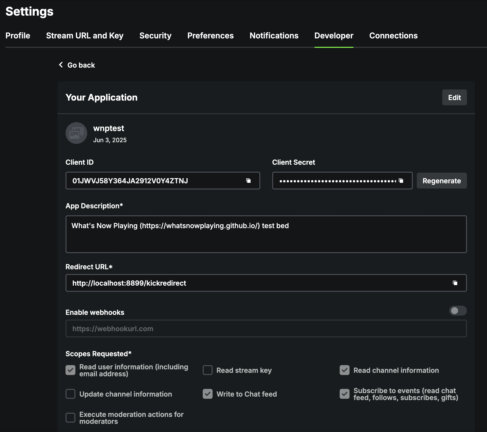
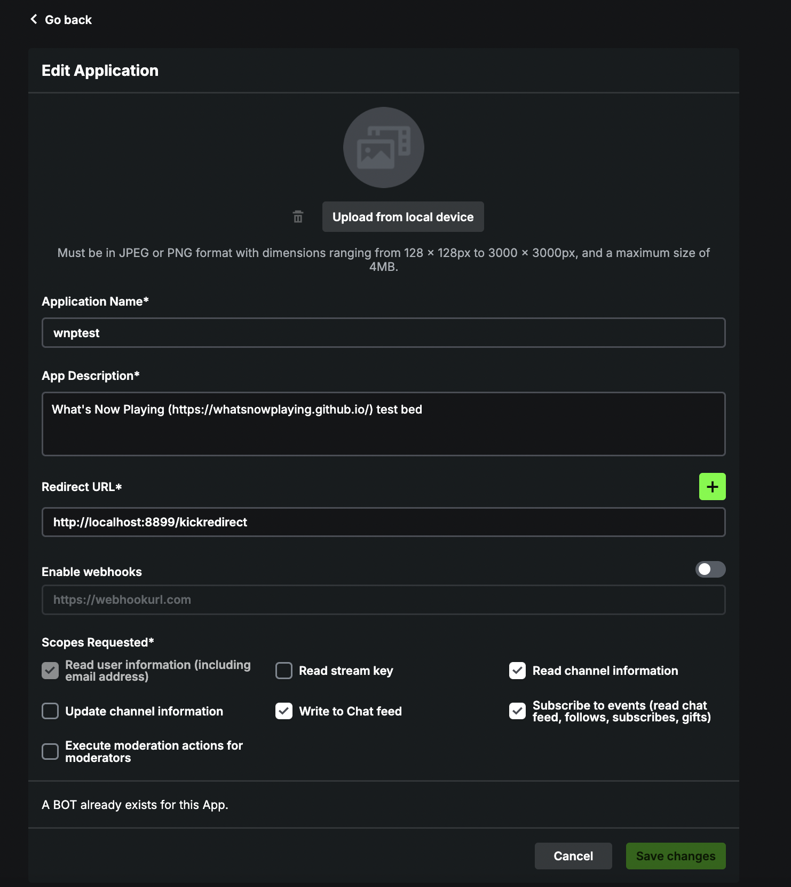
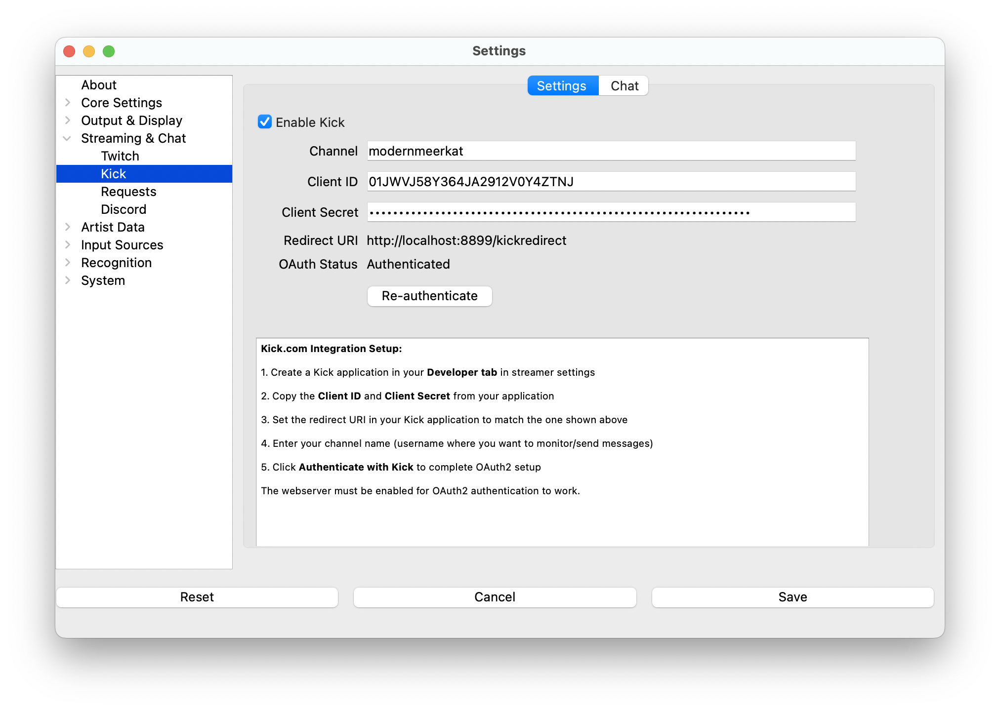

# KickBot

**What's Now Playing** integrates with Kick.com to provide chat bot
functionality with track announcements.

## Kick Chat Support

The current Kick integration supports:

- **Track Announcements**: Automatic announcements when tracks change
- **Template-based Messages**: Rich formatting with metadata variables
- **Smart Message Splitting**: Intelligent splitting of long messages

**Coming Soon**:

> - Interactive chat commands and user input processing.
> - Point Redemptions

## Authentication

To use Kick.com integration, you'll need to set up OAuth2 authentication
with your Kick account.

1. Go to your Kick streamer settings and navigate to the **Developer**
   tab to create an application.
2. Create a new OAuth2 application with these important settings:
   - **Application Type**: Set to **Bot** (required for chat
     functionality)
   - **Application Name**: This will be the name displayed in chat when
     the bot sends messages
   - Note down your Client ID and Client Secret
   - Set Redirect URI to `http://localhost:8899/kickredirect` (port
     must match your webserver settings, default is 8899)

1. Click on the Edit button to make a few more changes
2. Scopes Requested should include the following for current and future
   features:
   - Read user information (including email address) - `user:read`
   - Write to chat feed - `chat:write`
   - Subscribe to events (read chat feed, follows, subscribes, gifts) -
     events:subscribe`
3. You should also make sure to select the option to make it a bot
   account.

1. In **What's Now Playing** settings, enter your Client ID and Client Secret
2. Set your Kick channel name
3. Click "Save" to store the configuration
4. **Important**: You must save the settings before proceeding to authentication
5. Click "Authenticate with Kick" to complete OAuth2 setup

## Template Features

Kick templates support powerful formatting features:

- **Template Variables**: All standard metadata variables
  (`{{ artist }}`, `{{ title }}`, etc.)
- **Message Splitting**: Use `{{ startnewmessage }}` to split long
  announcements across multiple messages
- **Smart Splitting**: Messages longer than 500 characters are
  automatically split at sentence or word boundaries using NLTK

Example announcement template:

    {{ artist }} - "{{ title }}"
     from {{ album }}
    {{ startnewmessage }}
    {{ artistshortbio }}

## Configuration

1. Enable Kick chat in the Kick settings tab
2. Configure your OAuth2 credentials
3. Set up your announcement template
4. Configure announcement delay if needed
5. Test the connection with the "Authenticate with Kick" button

## Current Limitations

- **Chat Commands**: Interactive commands are not yet implemented
  (coming soon)
- **Permissions**: User permission system will be added with command
  support

The Kick integration uses the same intelligent message splitting
technology as the enhanced Twitch integration, ensuring that long
messages with rich metadata are delivered in full while respecting
platform limits.
