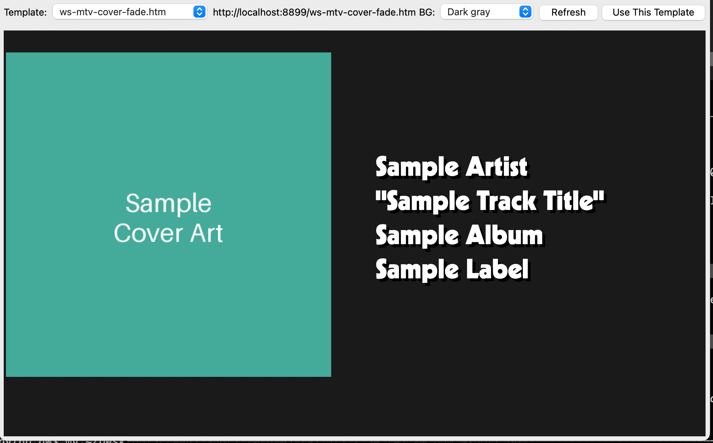

# Export for OBS

**What's Now Playing** can generate a ready-to-import OBS 28+ scene collection
JSON file containing pre-configured browser sources for your overlays.

> NOTE: This feature requires OBS Studio 28 or later and the built-in
> [Web Server](webserver.md) output to be enabled and running.

## Opening the Export Dialog

Select **Export for OBS...** from the **What's Now Playing** system tray menu.

## Configuring Sources

The dialog lists the available browser sources. For each source you can:

* **Include** — check or uncheck to include or exclude it from the export
* **Source** — the name that will appear in OBS Studio
* **Template** — the template file served at that browser source's URL
* **Width / Height** — the pixel dimensions of the browser source
* **Position** — where the source is placed on the canvas:
  * `fill` — scaled to fill the entire canvas (good for full-screen backgrounds)
  * `top` — anchored to the top-left corner
  * `bottom` — anchored to the bottom of the canvas
  * `left` — vertically centred on the left edge
  * `right` — vertically centred on the right edge
  * `center` — centred on the canvas

### Previewing a Template

Click **Preview** on any row to open a live preview of that source's template
in your browser. Use the template dropdown in the preview window to try
different templates, then click **Use This Template** to apply your choice
back to that row.

## Exporting

Click **Export** to generate the scene collection file. **What's Now Playing**
will save it to:

* **macOS**: `~/Library/Application Support/obs-studio/basic/scenes/`
* **Windows**: `%APPDATA%\obs-studio\basic\scenes\`
* **Linux**: `~/.config/obs-studio/basic/scenes/`

If the OBS scenes directory is not found, the file is saved to
`~/Documents/WhatsNowPlaying/obs_scenes/` instead.

The filename follows the pattern `WNP-YYYY-MM-DD-HHMMSS.json`.

## Importing into OBS

> NOTE: **OBS Studio must not be running** when you export. OBS reads its
> scene collection files on startup, so quit OBS before clicking Export,
> then relaunch it to pick up the new collection.

After exporting and relaunching OBS:

1. Open the **Scene Collection** menu in the OBS menu bar
2. The new **WhatsNowPlaying** collection will appear in the list — click it
   to switch to it

The collection contains two scenes:

* **WNP Sources** — the browser sources you selected and configured in the
  export dialog, already sized and positioned
* **WNP Guess Game** — three fixed sources for the Guess Game feature:
  the game overlay, the session leaderboard, and the all-time leaderboard

Both scenes are intended as a source library. Copy the individual browser
sources from either scene into your own scenes as needed.
