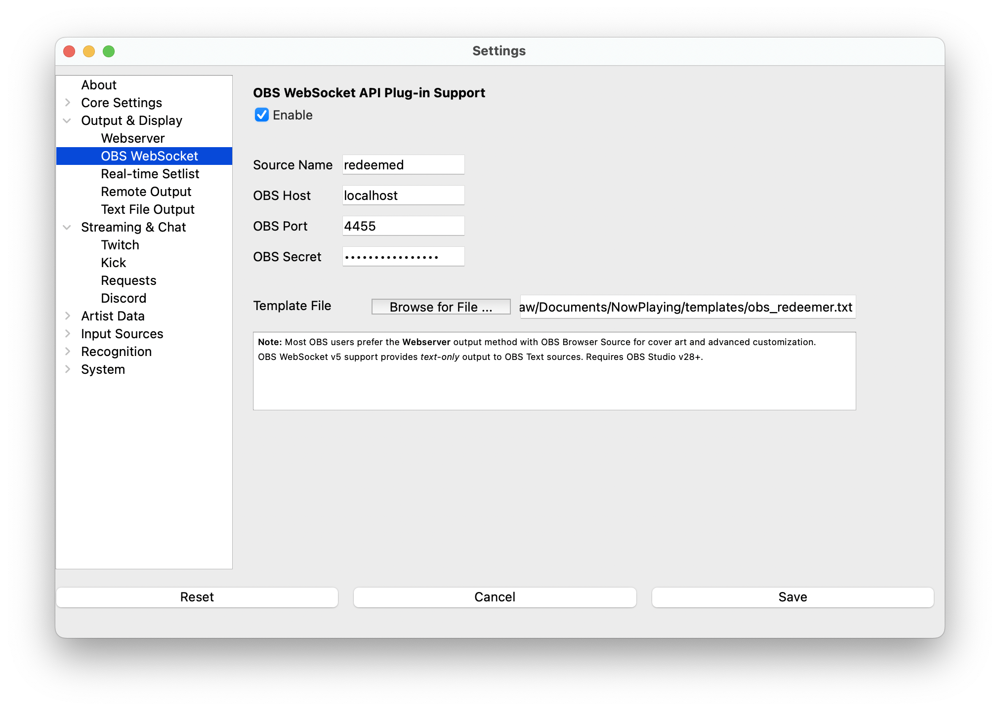

# OBS WebSocket Plug-in

**What's Now Playing** can use the OBS WebSocket v5 protocol to send
results directly to OBS Studio. OBS WebSocket v5 protocol was added as a
standard feature in OBS Studio v28. It will not work with older
versions.

> NOTE: The vast majority of OBS users use the
> [Webserver](webserver.md) output to take advantage of cover art and
> more. This version **only** provides text and only to an OBS Text
> source.

## Installation

1. Configure the OBS WebSocket settings in OBS Studio
   (Tools-\>obs-websocket Settings)
2. Configure OBS to have a Text source, keeping track of the name of
   the source name.
3. Open Settings from the **What's Now Playing** icon
4. Select OBS WebSocket from the list of available input sources.

1. Check Enable
2. Set the Source Name to be the same as your Source in OBS Studio.
3. In OBS Studio, under Tools-\>obs-websocket Settings, select Show Connect Info
4. In **What's Now Playing**, set the OBS Host, OBS Port, and OBS
   Secret. If the machine running OBS and running **What's Now
   Playing** are the same host, set OBS Host to be 'localhost'
5. Browse and select the template file that you would like to use as
   output.
6. Click Save
