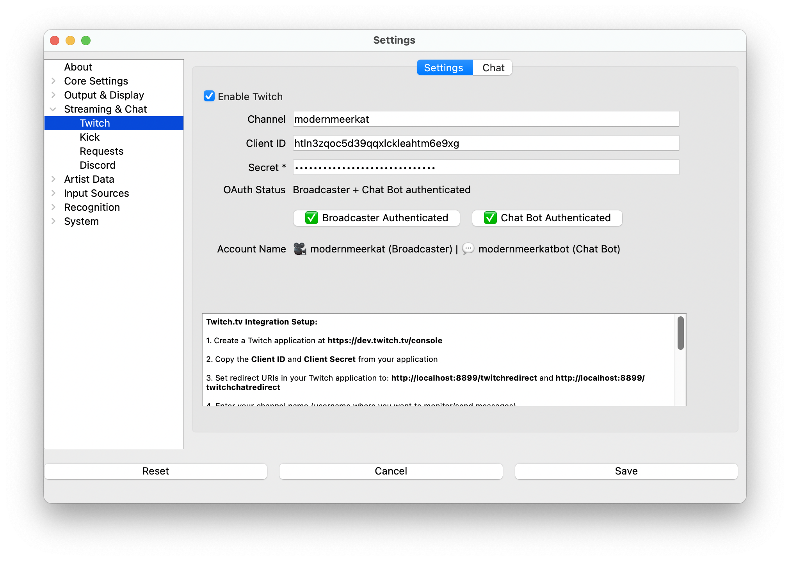

# TwitchBot

**What's Now Playing** integrates with Twitch with channel point
redemptions and chat. They may be run independently or run both at
the same time.

## Twitch Chat Support

The chat bot support includes track announcement as well as interactive
features.

For example, in chat, if the user types:

    !track

**What's Now Playing** will read a file called `twitchbot_track.txt` and
expand any template values in it. The Twitchbot settings section sets
permissions for commands.

Additionally, the Twitchbot can send an announcement template to chat
when **What's Now Playing** detects a song change or when a track
Request has been fulfilled.

## Twitch Channel Point Redemptions

Currently, channel point redemptions allow for users to request songs,
either by artist/title or picking a random song in a 'roulette' mode
when that redemption is tied to a supported DJ's software
crate/playlist. For more information see [Requests](../requests.md).

## Authentication

**What's Now Playing** uses OAuth2 authentication for secure integration with Twitch.  For redemptions,
you will need to authenticate against your own account.  For the chat bot, you can either use your
account or create and use another account.

### Setup Process

1. **Create Bot Account** (Optional but recommended)

   1. Follow the Twitch process for creating a new account.
   2. On the new account, be sure to enable:

      * Multiple logins per email
      * Two-factor authentication (2FA)

   

2. **Register Application on Twitch**

   1. Go to [Twitch Developer Console](<https://dev.twitch.tv/console>)
   2. Click Login in the upper right
   3. Click on "Your Console" in the upper right
   4. Click on "Applications"
   5. Click on "Register Your Application"
   6. **Name**: Choose a descriptive name (e.g., "YourChannel Now Playing Bot")
   7. **OAuth Redirect URLs**: Enter **both** redirect URIs as shown in **What's Now Playing**'s Twitch settings:
      * `http://localhost:8899/twitchredirect`
      * `http://localhost:8899/twitchchatredirect`
   8. **Category**: Chat Bot
   9. Click "Create"
   10. Click on "Manage" and save a copy of the **Client ID**
   11. Click on "New Secret" and save a copy of the **Client Secret**

3. **Configure What's Now Playing**

   1. Open Settings from the **What's Now Playing** icon
   2. Select "Twitch" from the list of settings available
   3. Fill in the required information:

      * **Channel**: Your Twitch channel name (where you want to monitor/send messages)
      * **Client ID**: From your Twitch application
      * **Client Secret**: From your Twitch application
      * **Redirect URI**: Will be automatically populated based on your webserver port

   4. Click "Save" to store the configuration
   5. Click "**Authenticate with Twitch**" to complete OAuth2 setup
   6. A browser will open - log in and authorize the application
   7. You should see "Authentication Successful" when complete

### OAuth2 vs Legacy Authentication

**What's Now Playing** now uses modern OAuth2 authentication instead of manual token generation. This provides:

* **Enhanced Security**: No need to manually copy/paste tokens
* **Automatic Token Refresh**: Tokens are refreshed automatically when they expire
* **Streamlined Setup**: One-click authentication through your browser
* **PKCE Security**: Uses Proof Key for Code Exchange for additional protection

!!! note
    Legacy Bot Token authentication is still supported for backward compatibility, but OAuth2 is recommended for new setups.

### Additional Setup Considerations

* **Bot Moderator Status**: Consider making your bot account a moderator on your channel to avoid rate limits,
  URL filters, and other restrictions.

* **Browser Authentication**: When you click "Authenticate with Twitch", a browser will open asking for permission.
  Make sure you're logged into the correct Twitch account:

  * For **channel point redemptions**: Log in as your **main streaming account** (the channel owner)
  * For **chat functionality**: Log in as your **bot account** (if using a separate bot account)

* **Required Permissions**: Accept the requested permissions (`chat:read` and `chat:edit`) to allow the bot to
  monitor and send messages.

### Legacy Token Authentication

For users who prefer manual token management or have existing setups, the legacy "Bot Token" field is still
supported. However, OAuth2 authentication is recommended for new installations as it provides better security
and automatic token management.

## Twitch Chat Configuration

1. Open Settings from the **What's Now Playing** icon
2. Select Twitch Chat from the list of settings available.

1. Check Enable
2. To have the bot announce new tracks in chat, select the template.

By default, the bot will respond to user commands in the form of Twitch
Replies. If you would prefer the bot just post a message, uncheck the
Replies option.

You are now ready to set permissions on user interactive commands.

### Setting Permissions

Upon launch, **What's Now Playing** will create an entry for every
`twitchbot_*.txt` file in the template
directory. These entries will all be set to completely disabled. In
order to enable them, you will need to check the appropriate field.

Twitchbot template files added while **What's Now Playing** is running
will let anyone use them until the next run. At the next run, it will
again change them back to no permissions granted.

Once the permissions are set and Save is clicked, those permissions will
be preserved on every restart.

### Adding New Commands

Create a new file in **What's Now Playing**'s`templates` directory
(`Documents/Now Playing/template`) called `twitchbot_yourcommand.txt`
where `yourcommand` is the actual command that will be executed by users
that have the appropriate template code inside it. Note that all text
will be smashed together as a single line when sent to Twitch, so be
mindful of where to put spaces.

### Built-in Commands

Post-v3.0.2, the Twitchbot will always respond to the command
'whatsnowplayingversion' . It will report the version that is running.

### Troubleshooting

* To test if the chat bot is working, you should be able to use the
  '!whatsnowplayingversion' command. **What's Now Playing** only needs
  to be running. You do not have to be live streaming to test chat.

* If the bot never connects, try getting a new OAuth token.

* Be aware that the bot may have trouble connecting if you restart
  **What's Now Playing** too quickly. It should eventually rejoin, but
  it may take several minutes.

### Additional Variables

The TwitchBot adds the following additional values for templating purposes:

| Variable | Description |
|----|----|
| cmduser | Person, bot, etc that typed the command |
| cmdtarget\[x\] | The x'th target on the command, starting with 0. For example, if the command was `!so modernmeerkat`, then `{{ cmdtarget[0] }}` will have `modernmeerkat` in it. See below for an example. |
| startnewmessage | Split the text at this location and start a new message to send to chat. |

!!! note "Token Selection"
    The system automatically uses the most appropriate token for sending messages.
    If you have both broadcaster and chat bot tokens authenticated, chat messages
    will be sent from the bot account for cleaner presentation.

### Multiple Targets

One of the more advanced capabilities that the TwitchBot supports is a
variable number of targets. This feature allows for your users to use
one command to perform actions on, for example, multiple users.

A simple example. Given this template file:

    @{{ cmduser }} hugs @{{ cmdtarget[0] }}

a user typing:

    modernmeerkat: !hug twitch

Would result in:

    bot: @modernmeerkat hugs @twitch

But this can be expanded to do multiple users at once:

    @{{ cmduser }} sends hugs to @{{ people }} 

such that:

    modernmeerkat: !hug person1 person2 person3

results in:

    bot: @modernmeerkat sends hugs to @person1 @person2 @person3

### Announcing Websites

You may want to add support for announcing the website data as part of
the Twitchbot track announcement. You can pick and choose which websites
are printed by taking the following code snippet and modifying as
necessary:

  
  
   |Bandcamp: {{ website }}
   | Discogs: {{ website }}
   | Facebook: {{ website }}
   | IG: {{ website }}
   | last.fm: {{ website }}
   | MusicBrainz: {{ website }}
   | Twitter: {{ website }}
   | Wikipedia: {{ website }}
   | YouTube: {{ website }}
   | Official homepage: {{ website }}
  
  
  
