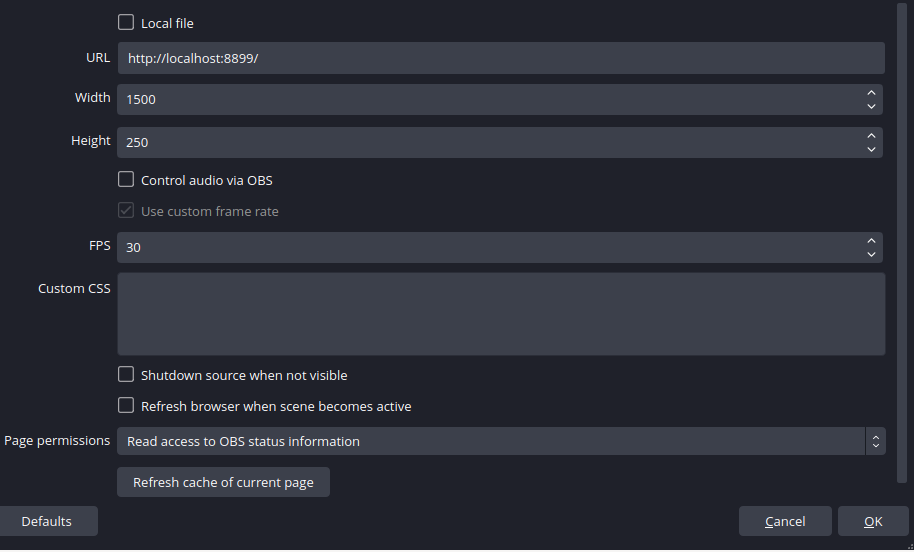

# Webserver

**What's Now Playing** has a built-in web server that serves track information to browsers,
OBS Studio, and custom integrations. It is enabled by default on port `8899`.

The `Documents/WhatsNowPlaying/templates` directory contains bundled WebSocket-based examples. Copy
and rename them to customize fonts, layout, and content.
See [Templates](../reference/templatevariables.md) for available variables.

## Setup

1. Open Settings from the **What's Now Playing** icon
2. Select **Output & Display → Web Server** from the left-hand menu
3. Check **Enable**
4. Change any settings as desired. See below.
5. Click **Save**

The webserver automatically advertises itself on the local network using Bonjour/Zeroconf, making it
discoverable by other **What's Now Playing** instances and compatible applications on the same subnet.
This feature is built into macOS, Windows 10+, and most Linux distributions.

## Settings

| Setting | Description |
|---------|-------------|
| Port | The HTTP server's TCP port. A firewall should protect this port for security reasons to limit which hosts will be permitted to connect. **What's Now Playing** does not limit what systems may connect to it. |
| HTML Template | The [Jinja2 template](https://jinja.palletsprojects.com/en/stable/templates/) file to use when fetching `/`. See [Templates](../reference/templatevariables.md) for more information. |
| Once | Only serve `/` once per title, then return an empty refresh page until the next song change. This setting is handy for providing a simple way to do fade-in and fade-out using simple HTML. |

## OBS Browser Source

To display track information as an overlay in OBS Studio, add a Browser Source and point it at
the webserver:

1. In OBS Studio, add a new **Browser Source**
2. Set the URL to `http://localhost:8899/`
3. Set the width and height to match your chosen template (check the `width` and `height`
   values in the template files)
4. Place the source wherever you would like in your scene

## Supported URLs

| URL | Description |
|-----|-------------|
| `/` (or `/index.htm`) | Renders the configured HTML template as a title card. |
| `/index.txt` | Same output as the text output in the General settings. |
| `/cover.png` | Returns the cover image, if available. |
| `/httpstatic/` | Any content in `Documents/WhatsNowPlaying/httpstatic` will be served under this URL. Use this to serve custom fonts, images, or CSS files referenced by your templates. |
| `/<templatename>.htm` | Renders any template file in the `templates` directory by name. |

Referencing `/<templatename>.htm` allows you to use more than one template at a time for advanced setups.

See also [Artist Extras](../extras/index.md) for other URLs when that
set of features is enabled.

## Custom Integrations

The webserver also exposes interfaces for custom software that needs programmatic access to track data.

### REST API

The webserver provides REST API endpoints for programmatic access to track information and remote input
functionality. See the [API Reference](../reference/api.md) for complete endpoint documentation.

### WebSockets

A continual feed is available via WebSockets. The feed is a JSON-formatted stream that updates on
every title change with no polling required. Connect using the URL `ws://hostname:port/wsstream`.
Note: the built-in web server does not support TLS, so `ws://` is used rather than `wss://`.
This is expected for a local network service.

The bundled templates that begin with `ws-` use WebSockets and are a good starting point for
custom overlays or integrations that need real-time updates.

Variables in the stream match what is documented on the
[Templates](../reference/templatevariables.md) page. Be aware that values may be null.
