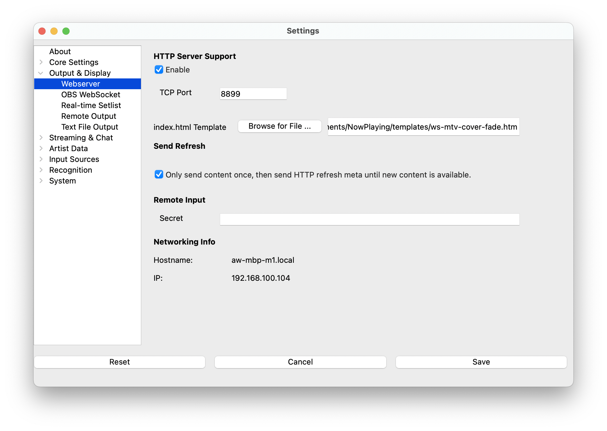

# Webserver

**What's Now Playing** has a built-in web server that allows for a wide
variety of customization and deployments, including complex ones
involving multiple hosts. Treat the files in`templates` as examples; copy them to new
names and modify them until you are happy. Change the font, change the
output order, do whatever it is you need to do.

Using one of the WebSocket examples as your starting point is
recommended as they are generally more predictable. They update when the
song updates vs. the others that use a timer to check for updates. See
more about WebSockets below.

## Installation

1. Open Settings from the **What's Now Playing** icon
2. Select OBS WebSocket from the list of available input sources.
3. Check Enable
4. Change any settings as desired. See below.
5. Click Save

## Settings

| Setting | Description |
|----|----|
| Port | The HTTP server's TCP port. A firewall should protect this port for security reasons to limit which hosts will be permitted to connect. **What's Now Playing** does not limit what systems may connect to it. |
| HTML Template | The [Jinja2 template](https://jinja.palletsprojects.com/en/3.1.x/templates/) file to use when fetching index.md. See [Templates](../reference/templatevariables.md) for more information. |
| Once | Only give index.md once per title, then return an empty refresh page until the next song change. This setting is handy for providing a simple way to do fade-in and fade-out using simple HTML. |

## OBS Settings

Once the webserver is enabled, hop into OBS and configure a Browser
source. Set the size to match the HTML template you are using. (Check
the `width` and `height` values in the bundled templates). Then place
the OBS source wherever you would like.

## Supported URLs

| URL | Description |
|----|----|
| /index.md (or /index.htm or just /) | This URL generates either a title card based upon the preconfigured template. |
| /index.txt | Same output as the text output in the General settings. |
| /cover.png | This URL will return the cover image, if available. |
| /httpstatic/ | Any content in\`Documents/NowPlaying/httpstatic\` will get served under this URL. |

See also [Artist Extras](../extras/index.md) for other URLs when that
set of features is enabled.

## REST API

The webserver provides REST API endpoints for programmatic access to track information and remote input
functionality. See the [API Reference](../reference/api.md) for complete endpoint documentation.

## WebSockets

New with version 3.0.0 is a continual feed via WebSockets. The feed is a
JSON-formatted stream that will get an update on every title change. To
connect, use the URL `ws://hostname:port/wsstream`. The files that begin
with `ws-` in the `templates` directory use WebSockets.

Variables set should match what is on the
[Templates](../reference/templatevariables.md) page. Be aware that
values may be null.
