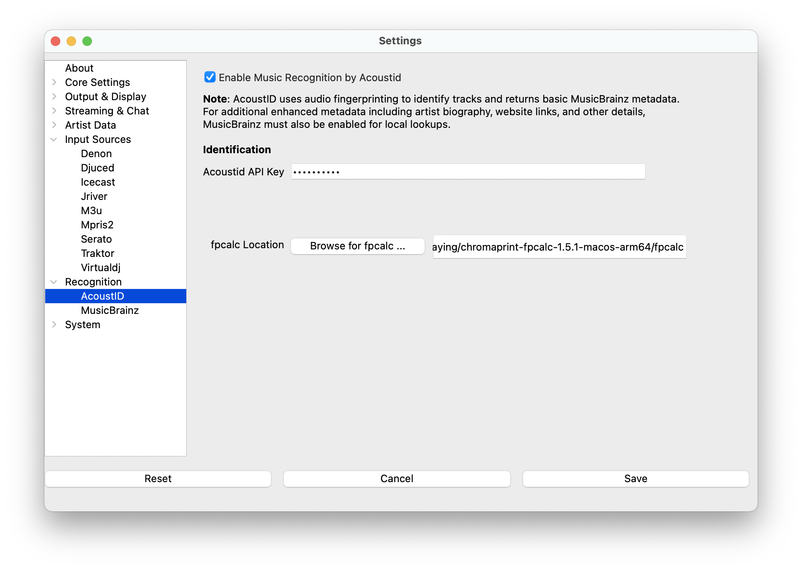

# AcoustID

AcoustID is a project providing a complete audio identification service based entirely on open-source
software. The service is completely free for non-commercial applications.

## How It Works

AcoustID uses audio fingerprinting to identify tracks and returns basic MusicBrainz metadata including:

- Track title, artist, and album information
- MusicBrainz IDs for recordings, artists, and releases

For additional enhanced metadata like artist biography and website links, MusicBrainz must also be enabled
for local lookups.

## Requirements

- [Register your application](https://acoustid.org/new-application) to get an API key
- [fpcalc binary](https://acoustid.org/chromaprint) installed on your system
- MusicBrainz enabled for enhanced metadata (optional but recommended)

## Limitations

- AcoustID's database is not as large or comprehensive as commercial services like Shazam
- Only samples the beginning of songs, so tracks with long introductions or extended intros may not be identified correctly

## Setup Instructions

1. Install the [fpcalc binary](https://acoustid.org/chromaprint) appropriate for your operating system
2. Open Settings from the **What's Now Playing** icon
3. Select Recognition->AcoustID from the left-hand column
4. Check "Enable Music Recognition by AcoustID"
5. Enter the API Key you received from AcoustID registration
6. Set the location of the fpcalc executable
7. Click Save

**What's Now Playing** will now use AcoustID to identify untagged tracks and provide basic metadata that
was not available from your DJ software or file tags.

> **Tip**: Enable MusicBrainz as well to get enhanced metadata including artist biographies, website
> links, and additional track details beyond what AcoustID provides.
