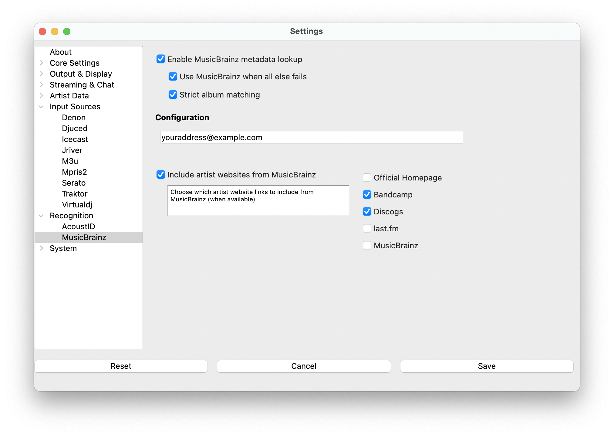

# MusicBrainz

MusicBrainz is an open music encyclopedia that collects music metadata and makes it available to the public.
**What's Now Playing** uses MusicBrainz to enhance track information with additional metadata.

## How It Works

MusicBrainz provides enhanced metadata beyond basic track identification:

- Artist biographies and detailed information
- Website links (official sites, social media, streaming platforms)
- Additional album and release information
- Relationships between artists, albums, and tracks

MusicBrainz works in two ways:

1. **With AcoustID**: Enhances tracks identified by AcoustID with additional metadata
2. **Standalone**: Attempts to match tracks based on existing artist/title information when other methods fail

## About MusicBrainz

MusicBrainz aims to be:

> The ultimate source of music information by allowing anyone to contribute and releasing the data under
> open licenses. The universal lingua franca for music by providing a reliable and unambiguous form of
> music identification, enabling both people and machines to have meaningful conversations about music.

Like Wikipedia, MusicBrainz is maintained by a global community of users and encourages everyone to
participate and contribute.

MusicBrainz is operated by the MetaBrainz Foundation, a California-based 501(c)(3) tax-exempt non-profit
corporation dedicated to keeping MusicBrainz free and open source.

## Setup Instructions

1. Open Settings from the **What's Now Playing** icon
2. Select Recognition->MusicBrainz from the left-hand column
3. Check "Enable MusicBrainz metadata lookups"
4. Enter your email address (required for API access)
5. Configure website options:
   - Check "Ask MusicBrainz for artist's websites" to fetch website links
   - Select which types of websites you want included
6. Click Save

## Fallback Mode

The "Use MusicBrainz when all else fails" option attempts to find metadata based primarily on existing
artist and title information. Accuracy is not guaranteed, but it can provide enough information for
[Artist Extras](../extras/index.md) to work without requiring AcoustID.

## Best Practices

- Always provide an email address for API access
- Enable website fetching if you want social media and official site links
- Other Artist Extras services use Musicbrainz identification as a requirement
