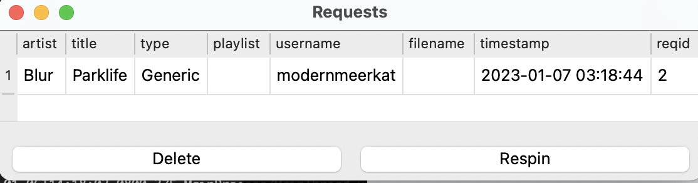
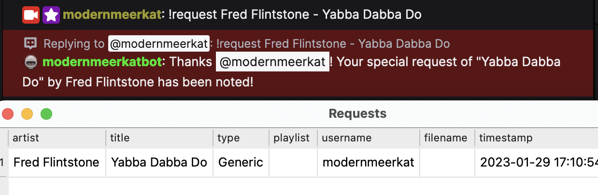
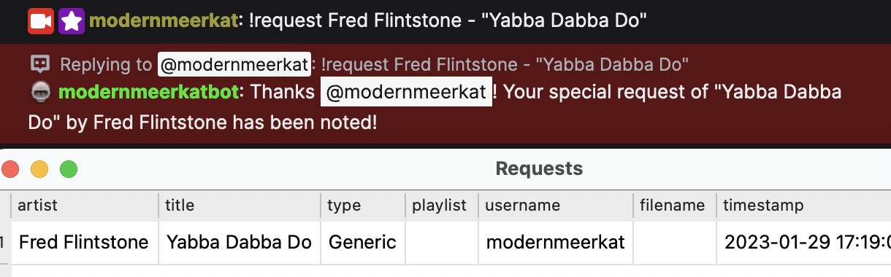
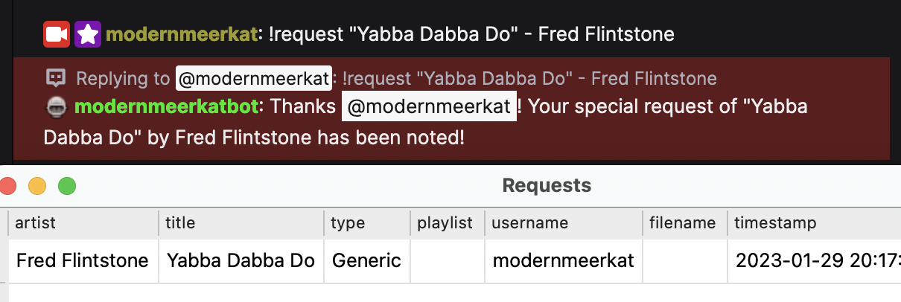
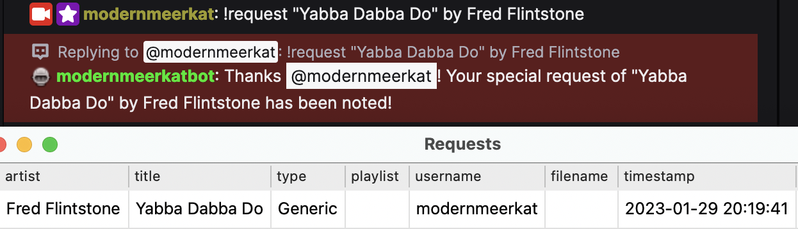
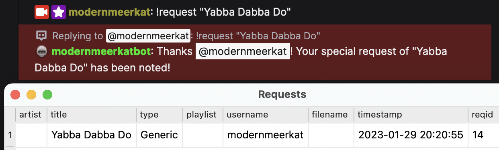
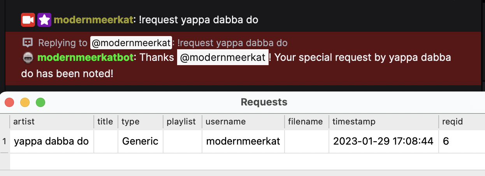
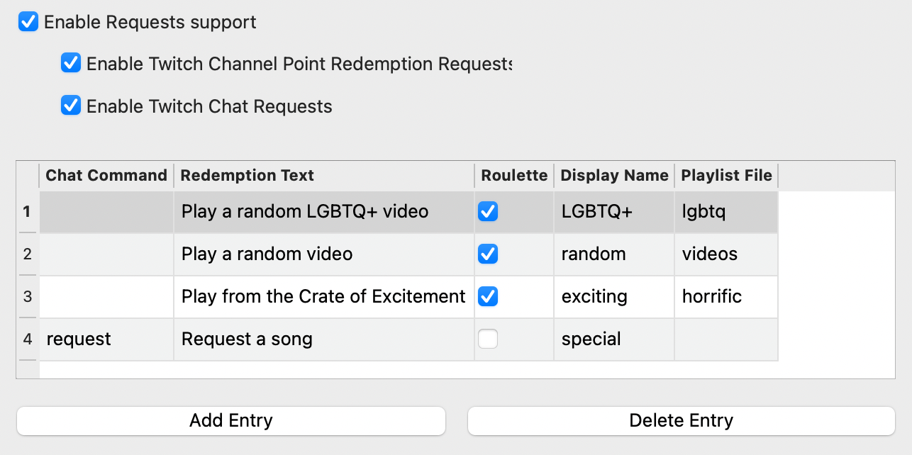

# User Track Requests

**What's Now Playing** has the ability to help manage requests that come
from Twitch users.

There are four types of requests: generic, twofers, roulette, and Gifwords:

- Generic requests are just that, user may request any track by
  specifying the artist and title.
- Twofers are requests where the artist is the currently playing artist
  and (optionally) a particular track may be selected.
- Roulette requests will pick a random song from the specified
  playlist/crate as the request.
- Gifwords requests allow users to submit keywords and **What's Now Playing**
  will fetch a related GIF image to display.

[](images/requests_generic.png)

If **What's Now Playing** detects the song has been played, it will be
removed from the Requests queue.

## Using Twitch Chat for Requests

To enable Twitch chat to be used for requests:

1. Configure and enable Twitch Chat support.
2. Create a command that will be used for requests. There is an example
    template file called 'twitchbot_request.txt' as an example.
3. Assign that command to the appropriate entry in the Requests
    settings in **What's Now Playing**. See later on below.

For non-roulette requests, artist and title information should be
entered on the chat line. For example:

    ```
    modernmeerkat: !request Blur - "Parklife"
    modernmeerkatbot: Thanks @modernmeerkat! Your special request of "Parklife" by Blur has been noted!
    ```

## Supported Request Formats

The following formats are supported, either as a chat command or as the
optional text in a Twitch Channel Point Redemption:

- artist - title

[](images/artist_title_request.png)

- artist - "title"

[](images/artist_title_withquotes_request.png)

- "title" - artist

[](images/title_artist_request.png)

- "title" by artist

[](images/title_by_artist_request.png)

- "title"

[](images/just_title_request.png)

Additionally, the following formats can be used to request a track for
someone else:

- artist - "title" for @username
- "title" by artist for @username

(Note that the username is not currently saved or processed in any way.)

Unless Twofer is being redeemed, anything else will be considered an
artist. For example:

[](images/generic_request.png)

For Twofers, anything else will be considered a track title since the
artist will always be the currently playing artist. Twofers are not
required to have additional input. In that case, the title will be
blank.

## Using Twitch Redemptions for Requests

To enable Twitch redemptions to be used for requests:

1. Configure and enable Twitch support with Client and Secret IDs.

2. Create a a reward in the Twitch UI. Keep track of the
   _exact_ text used in the reward description.

3. If the channel redemption is not a roulette request, then the reward
   should take user input to provide the artist and title information.

4. Copy the exact text into the 'Redemption Text' field in the
    appropriate entry in the Requests settings in **What's Now
    Playing**.

    NOTE: **What's Now Playing** does not manage the Twitch-side Reward
    Requests Queue. You will still need to approve or refund channel
    points in the Twitch moderator panel.

## Configuring Requests

[](images/requests_settings.png)

1. Under Settings, select Requests.
2. Enable Requests support
3. Enable one or both of Twitch Channel Redemption Requests and Twitch
   Chat Requests depending upon your needs.
4. Add Entry
5. Change the Chat Command to the Twitch Chat command in order to
   enable this Request via chat.
6. Put in the exact Twitch reward text in the Redemption Text field to
   enable this Request via channel points.
7. Select the mode as appropriate. By default, Generic will be used.
8. Fill in a displayname. This name will be shown to users when
   referencing requests of this type.
9. For roulette requests, enter in the playlist or crate name. See
   below for more information.

## Roulette Playlists

In order for Roulette requests to work, **What's Now Playing** needs to
have a list of tracks to use. The name here should match the name that
your DJ software also uses:

Serato: The name of the crate or smart crate. Virtual DJ: playlist name
Traktor: playlist name

> NOTE: See the section on your particular DJ software for known
> caveats/issues.

If the random song picked is not desired (inappropriate, already played,
etc), you may force the software to re-pick:

1. Selecting the track in the Requests window.
2. Click Respin
3. Wait a few moments for the software to pick a new one. (It does not
   do it immediately.)
4. The track should get replaced with a different one.
5. If it is still not desired, repeat this process as many times as
   necessary.

The software will keep track of which artists have been played during
Roulette. It will try to avoid repeating the same artist in the same DJ
session. If it runs out or cannot pick one a non-duplicate fast enough,
it will still offer up a duplicate artist.

> NOTE: There is no notification to users that Respin has been selected.
>
> NOTE: For Traktor and Virtual DJ, Roulette requests require local
> files.

## Gifwords Requests

Gifwords requests allow viewers to submit keywords that **What's Now Playing** uses to fetch a related
GIF image. The GIF can then be displayed on stream via OBS or other streaming software.

### Configuring API Keys

To enable Gifwords requests, you need an API key from either Klipy (recommended) or Tenor:

- **Klipy** (Recommended): <https://klipy.com/docs> - Free API that replaces the legacy Tenor service
- **Tenor**: <https://developers.google.com/tenor> - Legacy support (being discontinued by Google)

If both API keys are configured, **What's Now Playing** will prefer Klipy over Tenor.

### Setup Instructions

1. Obtain an API key from Klipy or Tenor (see links above)
2. Open Settings from the **What's Now Playing** icon
3. Select Requests from the left-hand column
4. Enter your API key:
   - For Klipy: paste into the "Klipy API Key" field
   - For Tenor: paste into the "Tenor API Key" field
5. Configure a request entry (chat command or channel redemption) with Gifwords mode
6. Users submit keywords via the configured command or redemption
7. The GIF is fetched and stored in the requests queue

### Displaying Gifwords in OBS

To display the fetched GIF on your stream, use the WebSocket template `ws-gifwords-fade.htm`:

1. In OBS, add a Browser Source
2. Set the URL to: `http://localhost:8899/ws-gifwords-fade.htm` (adjust port if needed)
3. The template automatically displays GIFs from the Gifwords queue with fade transitions
4. Gifwords are delivered via WebSocket, so the display updates in real-time as requests come in

> NOTE: Gifwords requests do not require track information - users only need to provide keywords
> describing the type of GIF they want.
