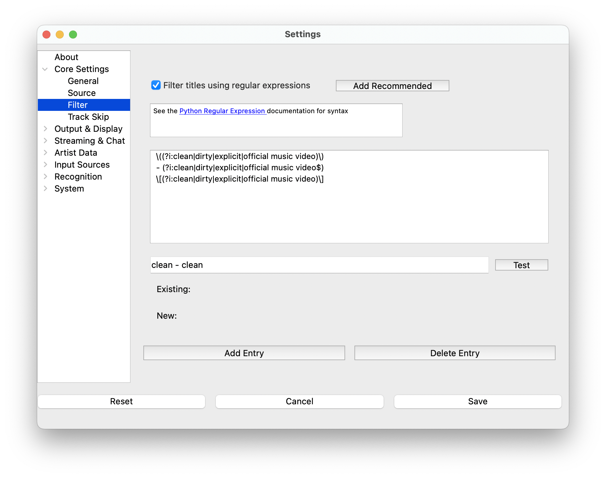

# Filter

Some DJ Pools add extra identifiers to track titles. **What's Now Playing** has
the ability to remove extra text from the title of a track using two types of
filters: **Simple** phrase-based filters and **Complex** regex patterns.

## Filter Types

**What's Now Playing** provides two filtering approaches:

### Simple Filters

The Simple tab provides an easy-to-use interface for filtering common
unwanted phrases from track titles. These filters work by matching
specific phrases in different formats (all case-insensitive):

* **- phrase**: Matches " - phrase" at the end of titles
* **(phrase)**: Matches " (phrase)" anywhere in titles
* **[phrase]**: Matches " [phrase]" anywhere in titles
* **plain**: Matches "phrase" anywhere in titles

#### Default Phrases

By default, these phrases are enabled for dash/paren/bracket filtering:

* Video quality indicators: 1080p, 480p, 4k, 720p, hd, high quality, hq
* Content descriptors: ce, cs, clean, clean version, dirty, explicit, explicit version
* Video types: lyric video, lyrics video, music video, official audio, official music video, official trailer, official video
* Audio processing: remaster, remastered

#### Managing Custom Phrases

* **Add custom phrases**: Enter text in the input field and click "Add"
* **Remove custom phrases**: Select a custom phrase row and click "Remove"
* **Configure formats**: Use checkboxes to enable/disable different matching formats for each phrase

### Complex Filters

The Complex tab allows advanced users to create custom
[Python-style regular expressions](https://docs.python.org/3/howto/regex.html)
for more sophisticated pattern matching.

#### Adding Complex Rules

1. Click "Add Entry" button
2. Click on the new entry in the list
3. Edit to be a regular expression

#### Managing Complex Rules

* **Delete entry**: Select entry and click "Delete Entry"
* **Reorder rules**: Drag entries to change application order
* **Add number patterns**: Click "Add Numbers" to add patterns that
  match numbers in parentheses/brackets like " (123)" and " [456]"

## Reset to Defaults

Click the "Reset to Defaults" button (located at the top right) to:

* Reset simple filters to application defaults
* Remove all custom phrases
* Clear all complex regex patterns

This provides a clean starting point if filters become misconfigured.

## Testing Your Filters

The test section at the bottom works with **both** simple and
complex filters together, showing exactly what will happen to track titles in real usage:

1. Enter test text in the input field
2. Click "Test" button
3. The result shows what the title becomes after applying **all active filters** (both simple and complex)

This unified testing ensures you see the complete filtering behavior that will be applied to your tracks.

## How Filters Are Applied

During playback, **What's Now Playing** applies filters in this order:

1. **Simple phrase filters** (plain text matching first, then regex patterns)
2. **Complex regex patterns** (in the order shown in the Complex tab)

Both types of filters work together to provide comprehensive title cleaning.
