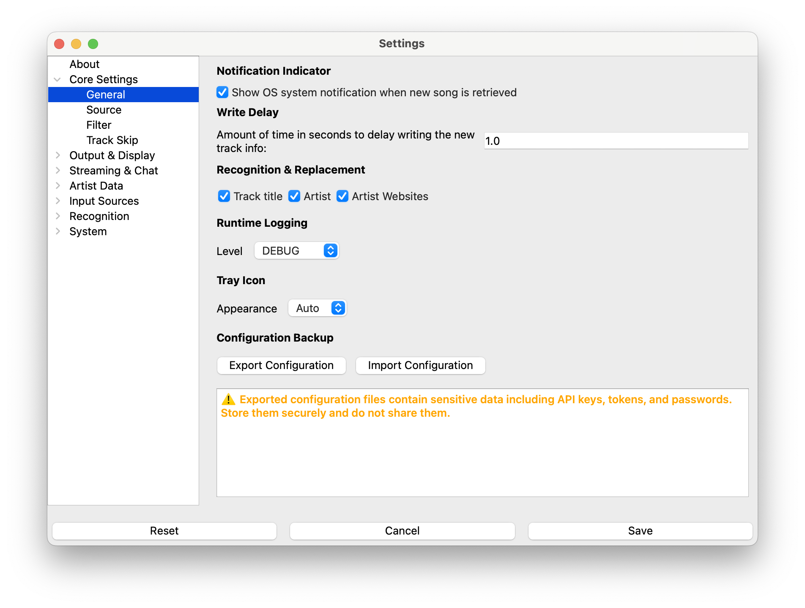

# General

* **Notification Indicator** - Selecting this option will show a system
  notification when new track info is detected.

  * This is useful for verifying that the app is polling and
    retrieving data.
  * The notification displays the track information after detection.
  * Some software (such as Serato) will not show notifications in
    full-screen mode. You may need to take it out of full screen mode
    to see the notification.

* **Write Delay** - The amount of time, in seconds, to delay writing the
  new track info once it's retrieved. If not populated, it will default
  to 0 seconds.

* A setting of zero will update the track info on-screen immediately
   as a new track is detected. If you're blending or crossfading, this
   may be too soon; viewers would see the new track title before they
   can hear it. A delay of 5–10 seconds gives your mix time to settle
   before the display updates. Artist Extras also uses this window to
   download images, so a longer delay means more content is ready when
   the track appears.

* **Recognition Replacement** - By default, if a Music Recognition
  service is enabled, it will only supplement missing information.
  These options forcibly replace title and artist from any enabled
  recognition services.

* **Logging Level** - By default, **What's Now Playing** will write
  debug logs into your `Documents/WhatsNowPlaying/logs` directory. This option
  lets you control the level of logging.

* **Configuration Backup** - Export and import your complete
  configuration to make version upgrades easier.

  * **Export Configuration** - Saves all your settings to a JSON file.
   This includes API keys, passwords, file paths, and all plugin
   configurations. ⚠️ **Security Warning**: The exported file
   contains sensitive data including API keys and passwords. Store it
   securely and do not share it.
  * **Import Configuration** - Restores settings from a previously
   exported JSON file. This will overwrite your current settings.
   Cache and runtime settings are automatically excluded and rebuilt.
   File paths that do not exist on the current machine are skipped
   automatically; a `_import_warnings.txt` file is generated next to the
   imported file listing any paths that need to be reconfigured manually.
  * **Portability**: The exporting machine's home directory is recorded in
   the file so paths are automatically remapped when importing on a different
   machine or operating system.
  * **Use Cases**:
    * Back up settings before major version upgrades
    * Transfer settings between installations
    * Restore settings after a fresh install
    * Recover from configuration corruption

At the bottom of every page will be the "Reset", "Cancel", and "Save"
buttons:

* **Reset** - Change all settings back to default
* **Cancel** - Close the window without saving
* **Save** - Save the settings
