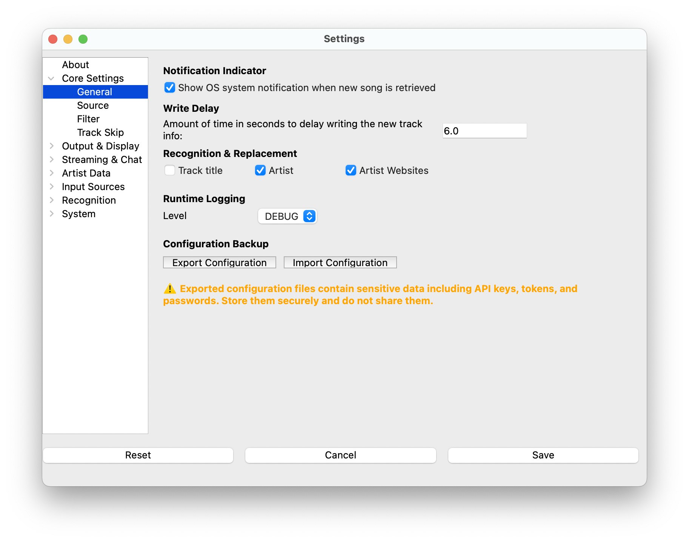

# General

- **Notification Indicator** - Selecting this option will show a system
  notification when new track info is detected.

  > - This is useful for verifying that the app is polling and
  >   retrieving data.
  > - The notification displays the track information after detection.
  > - Some software (such as Serato) will not show notifications in
  >   full-screen mode. You may need to take it out of full screen node
  >   to see the notification.

- **Write Delay** - The amount of time, in seconds, to delay writing the
  new track info once it's retrieved. If not populated, it will default
  to 0 seconds.

  > - A setting of zero will update the track info on-screen immediately
  >   as a new track is detected. This time value may be too soon for
  >   some DJ's mixing style as well as some features. Increasing the
  >   write delay allows for much more tuning.

- **Recognition Replacement** - By default, if a Music Recognition
  service is enabled, it will only supplement any missing information.
  These options forcibly replace title and artist from any enabled
  recognition services.

- **Logging Level** - By default, **What's Now Playing** will write
  debug logs into your Documents/NowPlaying/Logs directory. This option
  lets you control the level of logging.

- **Configuration Backup** - Export and import your complete
  configuration to make version upgrades easier.

  > - **Export Configuration** - Saves all your settings to a JSON file.
  >   This includes API keys, passwords, file paths, and all plugin
  >   configurations. ⚠️ **Security Warning**: The exported file
  >   contains sensitive data including API keys and passwords. Store it
  >   securely and do not share it.
  > - **Import Configuration** - Restores settings from a previously
  >   exported JSON file. This will overwrite your current settings.
  >   Cache and runtime settings are automatically excluded and rebuilt.
  > - **Use Cases**:
  >   - Back up settings before major version upgrades
  >   - Transfer settings between installations
  >   - Restore settings after a fresh install
  >   - Recover from configuration corruption

At the bottom of every page will be the "Reset", "Cancel", and "Save"
buttons:

- **Reset** - Change all settings back to default.
- **Cancel** - Close the window without saving.
- **Save** - Save the settings
