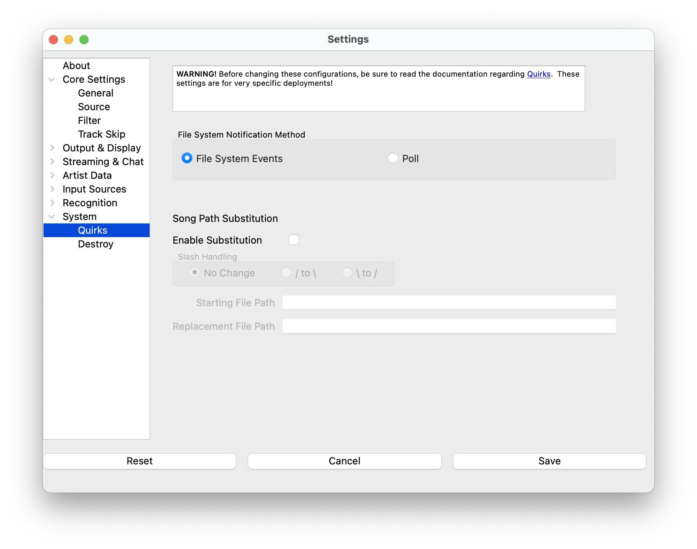

# Quirks

Under some very specialized circumstances, it may be necessary to
'nudge' **What's Now Playing** to do something particularly special in
order to get the desired impact. The options under quirks allow one to
do just that. In general, however, users should stick with the defaults
for optimal performance.

> **Note**: Quirks settings are located under System in the settings menu.

## File System Notification Method

By default, **What's Now Playing** uses operating system facilities to
know when input files have changed. If **What's Now Playing** is running on a
different host than the DJ software and **What's Now Playing** have
been configured to read the DJ software's directory over a network mount
(such as SMB) **What's Now Playing** may not get notified that a
file has changed. Selecting the \`poll` option will force the
application to perform a manual file system check. The drawbacks to this
method are that more CPU and disk IO is performed and being on delay to
get updates. However, the software will not miss events.

> NOTE: Changing this value REQUIRES a restart of the **What's Now
> Playing** software.

## Song Path Substitution

Like the previous issue, the DJ software's files may reference a file
path unlike what **What's Now Playing** has access to on the machine
where it is running. Setting these values will allow you to do a 'search
and replace' of any referenced song files.

For example:

> - Starting File Path is set to `/Volumes/Music/`
> - Replacement File Path is set to `/Macintosh HD/Music/`

The DJ software says that it read
`/Volumes/Music/Blondie/Heart_of_Glass.mp3`. **What's Now Playing** will
instead interpret that the filename is actually
`/Macintosh HD/Music/Blondie/Heart_of_Glass.mp3` when reading extra
tags, performing recognition, etc.

The Slash Handling setting allows you to switch the direction of all
slashes in the filenames. This setting is beneficial when substituting
filenames from Windows to other operating systems and vice-versa. The
slash changes happen before path substitution, so keep that in mind. For
example,

> - Slash Handling: `\ to /` is set
> - Starting File Path: `Z:/av`
> - Replacement File Path: `/av`

If the original file was `Z:\av\Music\Band\Cool Song.mp3`, the above
settings will change that to `/av/Music/Band/Cool Song.mp3`. Another
example:

> - Slash Handling: `/ to \` is set
> - Starting File Path: `\av`
> - Replacement File Path: `Z:\av`

will do the reverse, from `/av/Music/Band/Cool Song.mp3` to
`Z:\av\Music\Band\Cool Song.mp3`

> NOTE: This quirk is not supported with MPRIS2.
