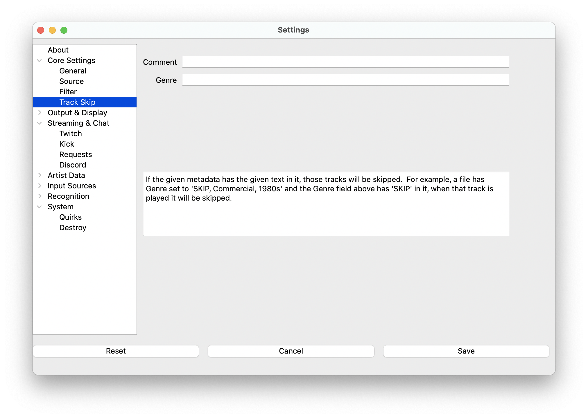

# Track Skip

Track Skip allows you to automatically skip tracks based on metadata fields. If a track's metadata contains specific
text in the Comment or Genre fields, that track will be skipped and not displayed as "now playing."

> **Note**: Track Skip settings are located under System in the settings menu.

## How It Works

Track Skip checks the Comment and Genre metadata fields of each track. If
either field contains the text you specify, the track will be skipped entirely.

For example:

* A track has Genre set to `SKIP, Commercial, 1980s`
* You set the Genre field to `SKIP`
* When that track is played, it will be skipped and not displayed

## Settings

### Comment Field Filter

Enter text that, if found in a track's Comment field, will cause the track to be skipped.

### Genre Field Filter

Enter text that, if found in a track's Genre field, will cause the track to be skipped.

## Usage Examples

### Skip Commercials

* Set Genre field to: `Commercial`
* Tag advertising tracks with Genre: `Commercial, Jingle`
* These tracks will be automatically skipped

### Skip Sound Effects

* Set Comment field to: `SFX`
* Tag sound effect files with Comment: `SFX - Airhorn`
* These files will be automatically skipped

### Skip Specific Content

* Set Genre field to: `SKIP`
* Tag any unwanted tracks with Genre: `SKIP`
* Provides a simple way to mark tracks for skipping

## Best Practices

* Use consistent tagging in your DJ software for tracks you want to skip
* Test your skip rules to ensure they work as expected
* Consider using specific tags like "COMMERCIAL" or "SFX" rather than generic words
* Remember that the text match is case-sensitive and looks for the specified text anywhere within the field
