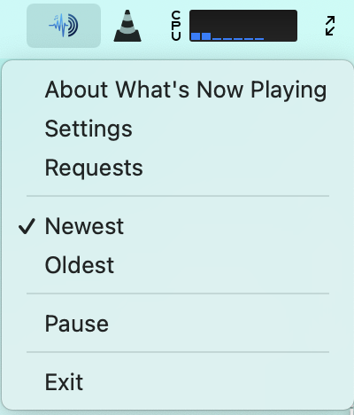

# Usage

Start **What's Now Playing** from wherever you installed it. On first launch,
a [Settings](settings/index.md) window will appear - configure your DJ software
and outputs, then click Save.

**After initial setup, the app runs in the background** and can be accessed through:

* **macOS**: Menu bar icon (top of screen)
* **Windows**: System tray icon (bottom-right corner)

## Menu Options

* **Settings** - Reconfigure the application. See [Settings](settings/index.md) for more information.
* **Oldest/Newest** - Toggle mixing mode detection (not supported by all DJ software):
  * *Oldest mode*: Tracks the oldest song across decks (for manual crossfading)
  * *Newest mode*: Tracks the newest song across decks (for AutoDJ/playlists)
* **Pause/Unpause** - Stop/resume track detection and output updates
* **Exit** - Quit **What's Now Playing**
